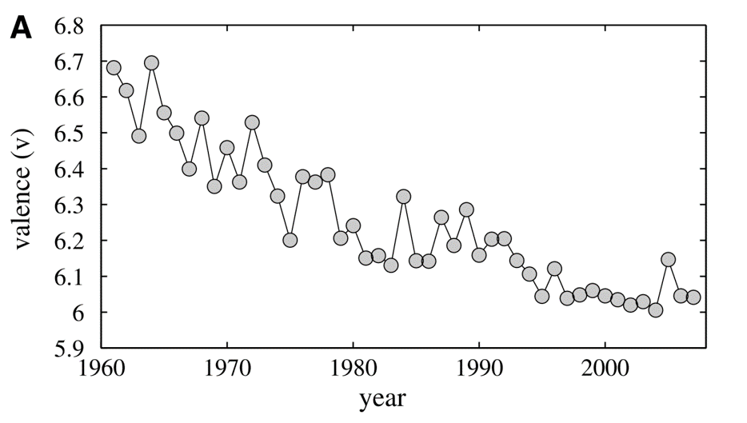
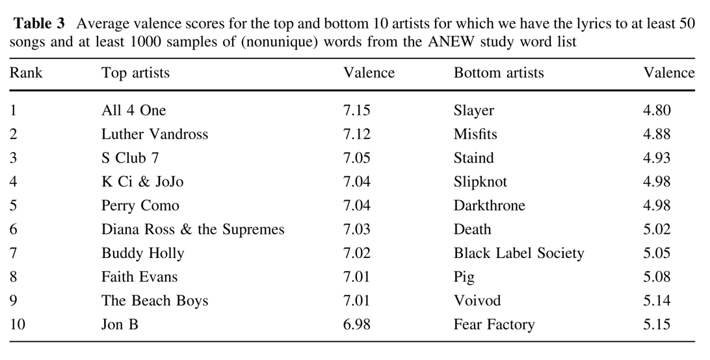
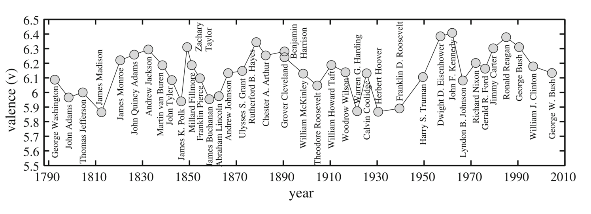
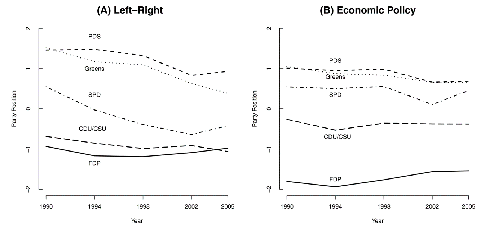

```{r setup, include=FALSE}
knitr::opts_chunk$set(echo = FALSE)
```

## Instructors

**Contact**:

- <a href="mailto:haber@hertie-schoolorg"><i class="fa fa-envelope"></i> haber@hertie-schoolorg</a>

- <a href="mailto:o.kononykhina@gmail.com  "><i class="fa fa-envelope"></i> o.kononykhina@gmail.com</a>

**Office Hours**:

- Room: 3.60

- By appointment

**Found errors?**

- <a href="https://github.com/mhaber/HertieTextAnalysis/issues"><i class="fa fa-exclamation-circle"></i> https://github.com/HertieDataScience/SyllabusAndLectures/issues</a>


## Today's Outline

**Quantitative text analysis (QTA)**

- What it is (and what it's not)
- Quantitative vs. qualitative text analysis
- Two examples

**Organization**

- Plan for the course
- Assignments & final project
- Prior knowledge, software, computers

## What is QTA (I)

**One variant of content analysis:**

- „[…] is a research technique for making replicable and valid inferences from texts (...) to the context of their use.“ (Krippendorff 2004).
- Content of text: Articles, speeches, blogs, conversation, …

## What is QTA (II)

**Numerical/quantitative representation of text**

- Quantitative measures
- Mostly based on word frequencies
- Quantitative measures can be analyzed using quantitative methods…

**Two approaches:**

- ‘Classical’ QTA: Hand coding (Sessions 5-7)
- Computerized analysis with varying degrees of user input (Sessions 8-12)


## What it's not

**Quantitative vs. qualitative text analysis**

- QTA does not interpret text (discourse analysis, social constructivist examination of text)
- QTA does not focus on form of texts (e.g. rhetorical analysis) but on content


## When use QTA

**Characterizing a large set of texts**

- E.g. finding the political standpoint of twitter users
- Users will use similar words to express like/dislike
- QTA methods provide measures

## When not to use QTA

**Interpreting a small number of texts very closely**

- E.g. determining the political standpoint of one editorial
- Irony, subtle negations, euphemisms
- QTA methods will fail, human reading superior

## Why use QTA?

**Many concepts relevant to social scientists leave traces in texts**

- Laws, treaties, speeches, media content, …

**Methods**

- Replicable & cheap
- Easy transfer from other disciplines

## Two examples

**Measuring happiness in society:**

- Dodds/Danforth 2009 
- Session 9

**Deriving party positions (Wordscores/Wordfish):**

- Laver/Benoit/Garry 2003; Slapin/Proksch 2008
- Sessions 10-11

## Example 1: Measuring happiness in society

- Can you quantify happiness in blogs, songs, etc.?
- Valence: Rating as good/bad; active/passive and strong/weak
- Derive valence of words, then count words to compute total valence of texts

## Happiness in song lyrics (I)



## Happiness in song lyrics (II)


## Happiness in song lyrics (III)



## Valence in State of the Union Addresses



## Positions in political text

- How do party positions evolve over time?
- Left and right dimension, parties use texts to communicate positions
- Derive how rightist/leftist words are, count words to compute left/right measure

## Content analysis of political texts



## Plan for the course

**Part I: Tools for Text analysis (Week 2-4)**

- Working with R, obtaining text

**Part II: 'Classical‘ content analysis (Week 5-7)**

- Handcoding methods, Comparative Manifestos Project, etc.

**Part III: Computerized text analysis (Week 8-12)**

- Dictionary methods, scaling, clustering, …

## Prior knowledge

- Focus on application!
- Prior knowledge:

    + Basic knowledge of statistical methods
    + Experience in R or other statistical software packages (e.g. STATA) is helpful
    
## GitHub

Setup Git/GitHub for version control, collaboration, and remotely storing your files.

- Set up (free) GitHub account: <https://github.com/join>.

- Install GitHub application: <https://desktop.github.com/>.

## Statistics software

- Install software:

    + R (version 3.3.2): <http://cran.rstudio.com/>
    + RStudio (dev build): <http://www.rstudio.org/download/daily/desktop/>

- Make sure that you can install R packages

## Requirements

**Part I and II each end with an assignment**

- Task/problem to solve
- Provide code or description of procedure
- Short essay corresponding to the problem
- Due on the week following the completion of a part

**Final research project**

- Uses one of the methods presented in class
- Discuss theory and research design, present (small) analysis 
- 8 pages, may team up (two students)
- Due on 15 May

**Participation in class**

- Regular attendance, active participation
- Ask questions!!!

