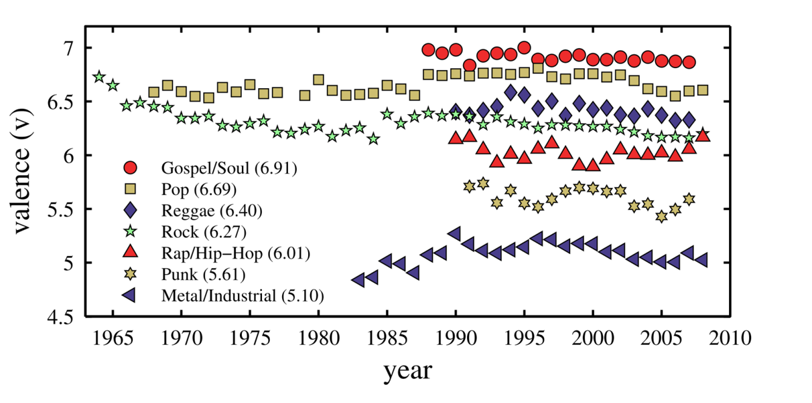
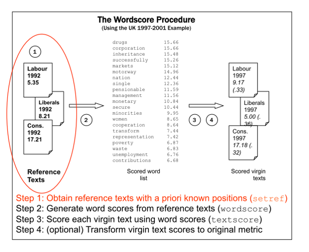
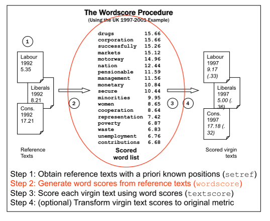
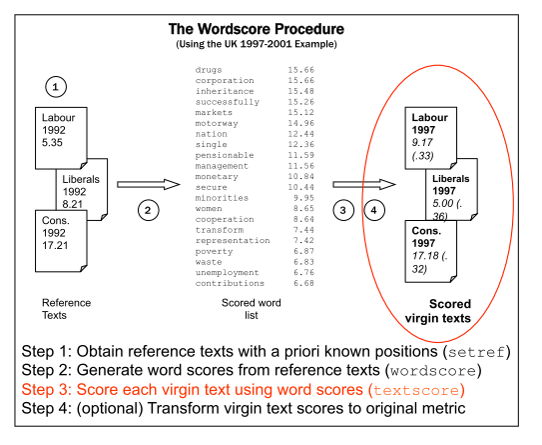
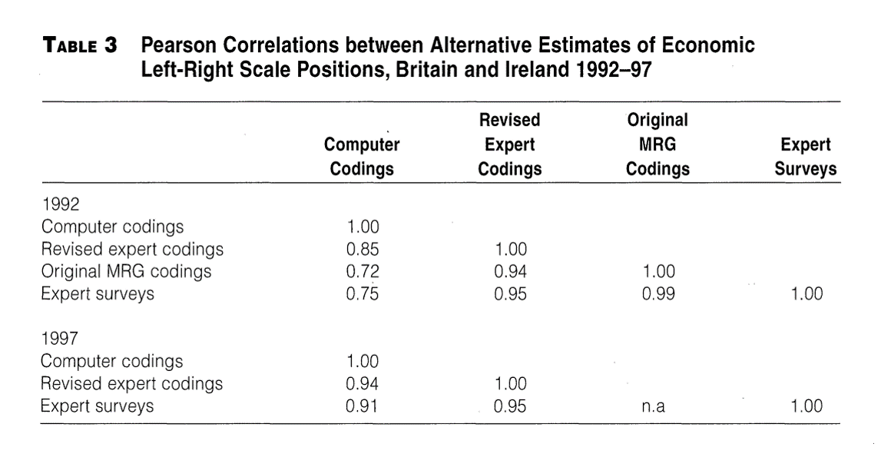
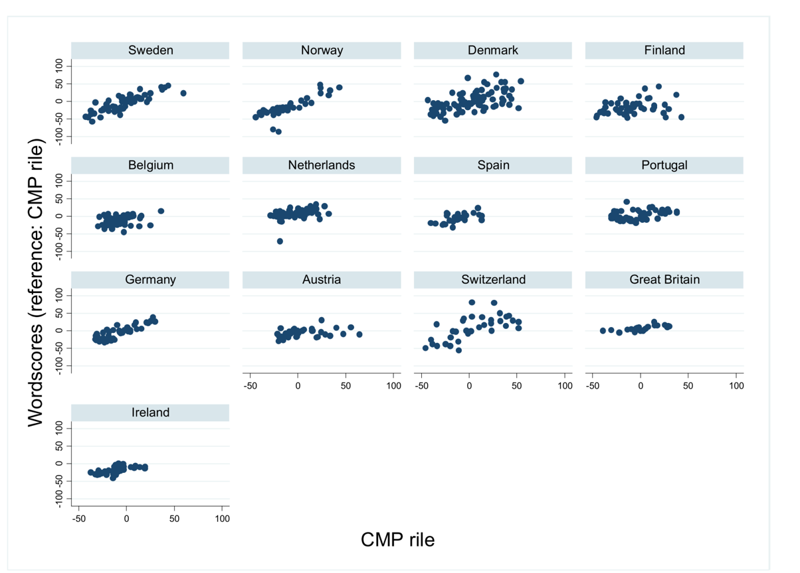
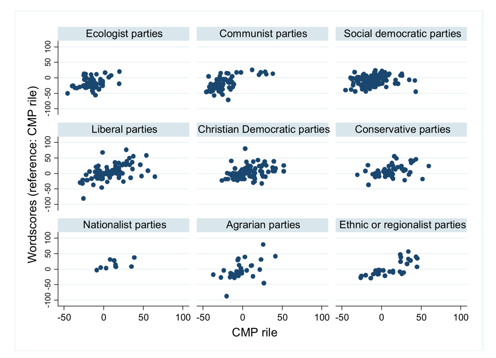

```{r setup, include=FALSE}
knitr::opts_chunk$set(collapse = T, cache=T, fig.align= "center", message = F,
                      warning = F, mysize=T, size='\\footnotesize')
knitr::knit_hooks$set(mysize = function(before, options, envir) {
  if (before) 
    return(options$size)
})
```

## Today's outline


- Dictionary Approaches
- Wordscores
- Final Project

## Set up to work along today's slides

**Working directory**
```{r}
wdir <- getwd()
```

**Packages**
```{r}
library(quanteda) # needs devtools & Matrix package
library(tm)
```

## Dictionary approaches

Dictionaries help classifying texts to categories or determine their content of a known concept. They are a hybrid procedure between qualitative and quantitative classification.
Dictionary construction involves a lot of contextual interpretation and qualitative judgment.

- Which text pertain to which categories?
- Which texts contain how much of a concept?

- Compared to e.g. CMP

    + Dictionaries require knowing the semantic form of the concept
    + i.e. one would need a complete dictionary of left or right statements
    
- Perfect reliability because there is no human decision making
as part of the text analysis procedure


## Rational for dictionaries

- Rather than count words that occur, pre-define words associated with specific meanings
- Two components:

    + **key** the label for the equivalence class for the concept or canonical term
    + **values** (multiple) terms or patterns that are declared equivalent occurences of the key class

- Frequently involves lemmatization: transformation of all in ected word forms to their "dictionary look-up form" -- more powerful than stemming

## Example 1: Linquistic inquiry

- Craeted by Pennebaker et al: http://www.liwc.net
- uses a dictionary to calculate the percentage of words in the text that match each of up to 82 language dimensions
- Consists of about 4,500 words and word stems, each defining one or more word categories or subdictionaries
- For example, the word _cried_ is part of five word categories: sadness, negative emotion, overall affect, verb, and past tense verb
- Hierarchical: so "anger" are part of an emotion category and a negative emotion subcategory
- You can buy it here: http://www.liwc.net/descriptiontable1.php


## Example 2: Terrorist speech

```{r, out.width = "220px", echo = F}
knitr::include_graphics("img/10-1.png")
```  

## Examples 3: Happiness in song lyrics

Valence time series for song titles broken down by representative genres (Dodds & Danforth 2009)

```{r, out.width = "320px", echo = F}

```  

## Examples 4: Happiness in blogs

Time series of average monthly valence for blog sentences starting with "I feel…" (Dodds & Danforth 2009)

```{r, out.width = "320px", echo = F}
knitr::include_graphics("img/10-3.png")
```  

## Advantage: Multi-lingual

```{r, out.width = "220px", echo = F}
knitr::include_graphics("img/10-4.png")
```  

## Disdvantage: Highly specific to context

- Example: Loughran and McDonald used the Harvard-IV-4
TagNeg (H4N) dictionary to classify sentiment for a corpus of 50,115 firm-year 10-K filings from 1994-2008
- they found that almost three-fourths of the "negative" words of
H4N were typically not negative in a financial context e.g. mine or cancer, or tax, cost, capital, board, liability, foreign, and vice
- Problem: **polysemes** words that have multiple meanings
- Another problem: dictionary lacked important negative financial words, such as felony, litigation, restated, misstatement, and unanticipated

## Creating dictionaries

**Creating Dictionaries**

- Scheme of classification
- Documents with known properties or classification

    + Training Set: Used to construct a dictionary
    + Test Set: Used to test dictionary (properties/classification is known)
    + Classification Set: Text to be classified/scaled with the dictionary


## Creating dictionaries (II)

**Sequence of steps**

- Collect the words that discriminate between categories/concepts, i.e. create a dictionary

    + Existing dictionaries
    + Creating a dictionary

- Quantify the occurence of these words in texts
- Validate


## Creating dictionaries (III)

**Methods (though not exhaustive)**

- By hand

    + Based on a Training Set (Laver & Garry)
    + Based on a previously existing list or external Sources (Dodds & Danforth)

- Automatically (Wordscores)

    + Replaces the creation of a dictionary as in Laver and Garry 2000

## Creating a simple dictionary

To create a simple dictionary of parts of speech, for instance we could define a dictionary consisting of articles and conjunctions, using:

```{r}
posDict <- dictionary(list(articles = c("the", "a", "and"),
           conjunctions = c("and", "but", "or", "nor", "for", "yet", "so")))
```
        
We can use this dictionary when we create a `dfm` to let this define a set of features:

```{r}
posDfm <- dfm(data_corpus_inaugural, dictionary=posDict)
posDfm[1:5,]
```

## Wordscores

Wordscores compares the word frequencies of texts at hand to the word frequencies of so called reference texts with known (or assumed) positions and assigns document scores based on the similarity of these references.

- Highly automated, (nearly) no language knowledge needed

## Wordscores concept

**The idea**

- Each word has a policy position (word score)
- Some reference document positions are known
- Document positions are average of its words' positions

- 1st step: Derive wordscores from reference texts
- 2nd step: Apply wordscores to virgin texts

## Wordscores: illustrative example

- Consider two reference texts A and B
- The word "choice" is used 10 times per 10,000 words in text A and 30 times per 10,000 words in text B
- Conditional on observing the word choice, we are reading text A with probability 0.25 and text B with probability 0.75
- We can compute a "word score" once we assign reference values to the reference texts
- Suppose reference text A has position -1, and text B position +1
- then the score of word "choice" is:

    + $0.25(-1.0)+0.75(1.0)=-0.25+0.75=0.5$


## Wordscores Procedure

```{r, out.width = "250px", echo = F}

```  


## Wordscores Procedure (II)

```{r, out.width = "250px", echo = F}

```  


## Wordscores Procedure (III)

```{r, out.width = "250px", echo = F}

```  


## Estimating Policy Positions from Political Texts

**Laver & Garry**

- Goal: Generating party positions for British and Irish manifestos

- Coding scheme similar to the CMP's

    + More hierachical, larger number of categories
    + Each category has a pro-, con- and neutral variant


## Estimating Policy Positions from Political Texts (II)

Assumptions:

1. Manifesto content is related to party policy positions
2. Word usage is realted to policy positions
3. Word usage is contant over time
4. All relevant words are coverered in the reference texts

How do these compare to the CMP assumptions?

## Estimating Policy Positions from Political Texts (III)

**1st step: Training set** 

- Manifestos of Labour and Cons (UK) in 1992

    + Pool of 'keywords'
    + $N_{L} \geq 2N_{R}=>$ Dictionary element left
    + $N_{R} \geq 2N_{L}=>$ Dictionary element right

- Allocate selected words to the coding scheme's categories

## Estimating Policy Positions from Political Texts (IV)
    
**2nd step: Count occurence of elements in the dictionary in manifestos**

- Britain (1992 & 1997)
- Ireland (1992 & 1997)

- Left-right-scaling: $\frac{R-L}{R+L}$ (see Session 7 and assignment 2)

    + "Updating process"
    + $Econ_{LR}$
    + $Soc_{LR}$

## Estimating Policy Positions from Political Texts (V)


**Test-Set: Crossvalidation**

- Expert Surveys
- CMP Coding/Revised CMP Coding

```{r, out.width = "250px", echo = F}

```  


## Wordscores and Dictionaries

- Conceptually, the two steps do the same in both approaches:

    + 1st step derives a position of a word from texts with known properties
    + 2nd step weighs the words in the unknown texts with this information

- Information in LG-Dictionary is binary, wordscores in wordscore are scale


## Selecting reference texts

- Reference texts should use the same vocabulary in the same context
- Reference texts need to span the full dimension
- Set of reference text should contain as many words as possible
- Estimates of the positions (reference scores) need to be well grounded and/or very conservative


## 1st step - Getting the wordscores

- Start out from the observed word frequencies in reference texts:
- $F_{wr}$: Relative frequency of word $w$ in reference-text $r$
- Conditional probabilities: Given we are observing word $w$, what is the probability that we are reading text $r$?


## 1st step - Obtaining wordscores

- Start out from the observed word frequencies in reference texts:
- $F_{wr}$: Relative frequency of word $w$ in reference-text $r$
- Conditional probabilities: Given we are observing word $w$, what is the probability that we are reading text $r$?

- $P_{wr} = \frac{F_{wr}}{\sum{_r}F_{wr}}$


## 1st step - Obtaining wordscores (II)

- $S_{w} = \sum{_r}(P_{wr}*A_{r})$

    + $A_{r}$ is the a priori score for reference text r

- $S_{w}$ is a weighted average of the a priori reference text score and the conditional probabilities for the word

    + The actual wordscore for word w
    
    
## 2nd step – Applying the wordscores

- $S_{v} = \sum{_w}(F_{wv}*S_w)$

    + $F_{wv}$ is analogous to $F_{wr}$
    + $S_v$ is the weighted mean score of the words in text $v$

- Variance is the basis for calculating uncertainty

    + Summary for the consensus of the scores of each word in the virgin text
    + Higher consensus -> lower variance -> less uncertainty
    
## Wordscores – Practical considerations

- What about scaling things other than manifestos?

- E.g. speeches:

    + Use reference texts from other context (e.g. manifesto)?
    + What scores to use?
    + Length of the reference texts?
    
## Wordscores in R

Wordscores (and Wordfish) are available in the `austin` package and in `quanteda`.

## Comparing wordscores and CMP

- Laver, Garry & Benoit use Irish and British manifestos to demonstrate/validate
- CMP data offers information for many countries and over long periods
- How do wordscores results compare across countries?

## Comparing wordscores and CMP (II)

- Bräuninger, Debus & Müller (2013) compare wordscores results for 13 countries between 1980 and 2000
- Reference texts are the manifestos in the latest elections
- Reference scores are the Rile scores from CMP
- Essentially 'replicate' CMP scores using wordscores

## Comparing wordscores and CMP (III)

```{r, out.width = "250px", echo = F}

```  


## Comparing wordscores and CMP (III)

```{r, out.width = "250px", echo = F}

```  


## Comparing wordscores and CMP (IV)

- Wordscores replicates CMP better whew

    + reference texts cover the full range of a dimension
    + the percentage of scored words is high

- Cross-check results from wordscores before using them in an analysis


## Wordscores exercise - download data and create corpus

```{r}
library(tm)
library(quanteda)
library(stringr)

# UK, DE, IE manifestos
wdir <- getwd()

temp <- tempfile(fileext = ".zip")
download.file(paste0("http://www.tcd.ie/Political_Science/wordscores/",
                     "files/WordscoresAPSR2_manifestos.zip"),
              temp)
unzip(zipfile= temp, exdir = wdir)
unlink(temp)

myTmCorpus <- VCorpus(DirSource(wdir, pattern = "\\.txt" , recursive = T))
mycorpusTM <- corpus(myTmCorpus)
```

## Wordscores exercise - Preprocessing

```{r}
manifestoDfm <- dfm(mycorpusTM, tolower=T, removePunct=T,
                    removeNumbers=T, removeSeparators = T,
                    remove = c(stopwords("english"), stopwords("german")))
manifestoDfm@Dimnames$docs <- names(myTmCorpus)
```

## Wordscores exercise - Create reference scores

```{r}
refs <- c(4.19,NA,NA,13.53, NA, 15.68,5.21, NA, 6.53,
          rep(NA, 8),4.50, 13.13,15.00,6.88,17.63,NA,
          17.21,NA, 5.35, 8.21, NA)
```

## Wordscores exercise - Run wordscores model

```{r}
ws <- textmodel(manifestoDfm, y = refs, model = "wordscores")
pred <- predict(ws)
```

## Wordscores exercise - Plot results
```{r, out.width = "250px"}
# plot estimated word positions (needs quanteda dev version)
textplot_scale1d(pred, margin = "features",
                 highlighted = "budget")
```

## Wordscores - Plot results (II)

```{r, out.width = "250px"}
# plot estimated document positions
textplot_scale1d(pred, margin = "documents",
                 doclabels = docvars(mycorpusTM, "id"))
```

## Final research project

- Apply one (or more) of the computarized text analysis techniques (dictionaries, wordscore, wordfish, topic modelling) in your own research project

    + must use text data
    
- ~8 pages detailing research question, data set, model specification, analysis and results
- team-work is encouraged
- Due 15 May


## Next Session

- Wordfish