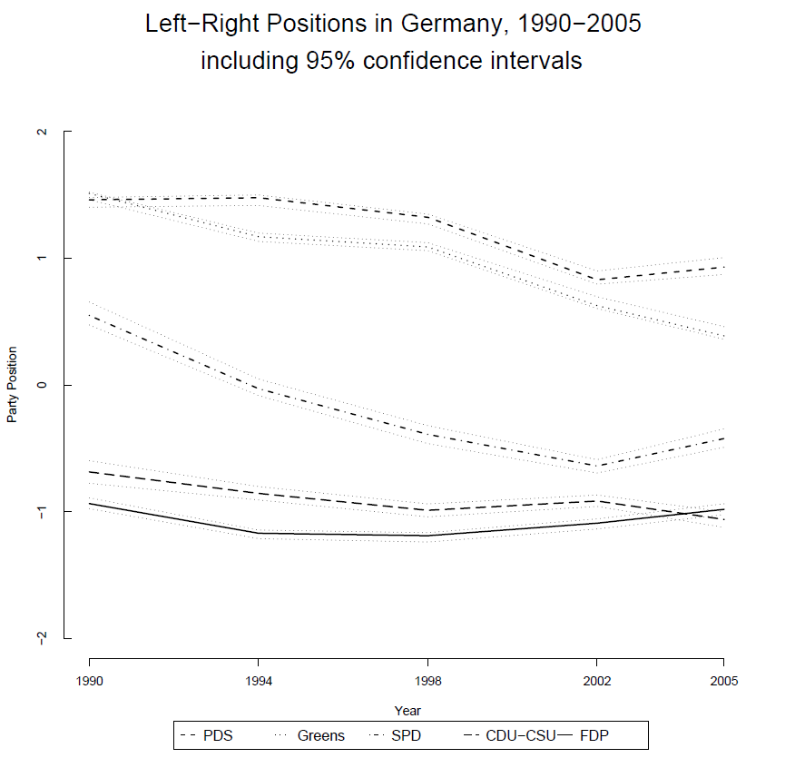
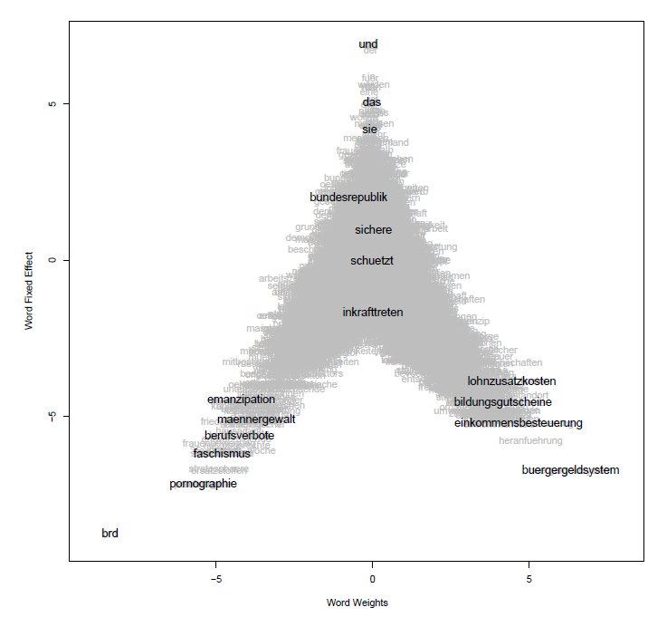

```{r setup, include=FALSE}
knitr::opts_chunk$set(collapse = T, cache=T, fig.align= "center", message = F,
                      warning = F, mysize=T, size='\\footnotesize')
knitr::knit_hooks$set(mysize = function(before, options, envir) {
  if (before) 
    return(options$size)
})
```

## Today's outline

- Web scraping in a nutshell
- Get Twitter data
- Get news media data
- Wordfish

## Online text data sources

- **web pages** (e.g. http://example.com)
- **web formats** (XML, HTML, JSON, ...)
- **web frameworks** (HTTP, URL, APIs, ...)
- **social media** (Twitter, Facebook, LinkedIn, Snapchat, Tumbler, ...)
- **data in the web** (speeches, laws, policy reports, news, ... )
- **web data** (page views, page ranks, IP-addresses, ...)

## The Problems

**phase**     | **problems** | **examples**
--------------|--------------|----------------------------------------
**download**  | protocols    | HTTP, HTTPS, POST, GET, ... 
&nbsp;        | procedures   | cookies, authentication, forms, ...
--------------|--------------|-----------------------------------------
**extraction**| parsing      | translating HTML (XML, JSON, ...) into R
&nbsp;        | extraction   | getting the relevant parts
&nbsp;        | cleansing    | cleaning up, restructure, combine


## Before scraping, do some googling!

- If the resource is well-known, someone else has probably built a tool which solves the problem for you.
- [ropensci](https://ropensci.org/) has a [ton of R packages](https://ropensci.org/packages/) providing easy-to-use interfaces to open data.
- The [Web Technologies and Services CRAN Task View](http://cran.r-project.org/web/views/WebTechnologies.html) is a great overview of various tools for working with data that lives on the web in R.

## Example

```{r, out.width = "300px", echo = F}
knitr::include_graphics("img/wikiTable.png")
```  


## Inspecting elements

```{r, out.width = "220px", echo = F}
knitr::include_graphics("img/inspect-element.png")
```  

## Hover to find desired elements

```{r, out.width = "260px", echo = F}
knitr::include_graphics("img/inspector.png")
```  


## Rvest

[rvest](https://github.com/hadley/rvest) is a nice R package for web-scraping by (you guessed it) Hadley Wickham.

- see also: https://github.com/hadley/rvest
- convenient package to scrape information from web pages
- builds on other packages, such as xml2 and httr
- provides very intuitive functions to import and process webpages


## Basic workflow of scraping with rvest


```{r}
library(rvest)
library(magrittr)

# 1. specify URL
"http://en.wikipedia.org/wiki/Table_(information)" %>% 

# 2. download static HTML behind the URL and parse it into an XML file
read_html() %>% 

# 3. extract specific nodes with CSS (or XPath)
html_node(".wikitable") %>%

# 4. extract content from nodes
html_table()
```

## Task 1

Navigate to *[this page](http://www.wunderground.com/history/airport/KVAY/2015/2/17/DailyHistory.html?req_city=Cherry+Hill&req_state=NJ&req_statename=New+Jersey&reqdb.zip=08002&reqdb.magic=1&reqdb.wmo=99999&MR=1)* and try the following:

**Easy**: Grab the table at the bottom of the page (hint: instead of grabbing a node by class with `html_node(".class")`, you can grab by id with `html_node("#id")`)

**Medium**: Grab the actual mean, max, and min temperature.

**Hard**: Grab the weather history graph and write the figure to disk (`download.file()` may be helpful here).


## Task 1 (solution)

```{r}
library(rvest)
src <- read_html(paste0("http://www.wunderground.com/history/",
"airport/KVAY/2015/2/17/DailyHistory.html?",
"req_city=Cherry+Hill&req_state=NJ&",
"req_statename=New+Jersey&reqdb.zip=08002",
"&reqdb.magic=1&reqdb.wmo=99999&MR=1"))

# easy solution
tab1 <- src %>% html_node("#obsTable") %>% html_table()
# medium solution
tab2 <- src %>% html_node("#historyTable") %>% html_table() %>%
  .[2:4, "Actual"]
# hard solution
link <- src %>% html_node("#history-graph-image img") %>% html_attr("src")
download.file(paste0("http://www.wunderground.com", link), 
              "fig.png", mode = "wb")
```

What about non-table data?

## Selectorgadget + rvest to the rescue!

- [Selectorgadget](http://selectorgadget.com/) is a [Chrome browser extension](https://chrome.google.com/webstore/detail/selectorgadget/mhjhnkcfbdhnjickkkdbjoemdmbfginb?hl=en) for quickly extracting desired parts of an HTML page.

- With some user feedback, the gadget find out the [CSS selector](http://www.w3.org/TR/2011/REC-css3-selectors-20110929/) that returns the highlighted page elements.

- Let's try it out on [this page](http://www.sec.gov/litigation/suspensions.shtml)


## Extracting links to download reports

```{r}
domain <- "http://www.sec.gov"
susp <- paste0(domain, "/litigation/suspensions.shtml")
hrefs <- read_html(susp) %>% html_nodes("tr+ tr a:nth-child(1)") %>% 
  html_attr(name = "href")
```

```{r, eval = FALSE}
# download all the pdfs!
hrefs <- hrefs[!is.na(hrefs)]
pdfs <- paste0(domain, hrefs)
mapply(download.file, pdfs, basename(pdfs))
```


## Technologies and Packages

- Regular Expressions / String Handling

    + **stringr**, stringi

- HTML / XML / XPAth / CSS Selectors

    + **rvest**, xml2, XML

- JSON

    + **jsonlite**, RJSONIO, rjson

- HTTP / HTTPS

    + **httr**, curl, Rcurl

- Javascript / Browser Automation

    + **RSelenium**

- URL

    + **urltools**

## Readings

- Basics on HTML, XML, JSON, HTTP, RegEx, XPath

    + Munzert et al. (2014): Automated Data Collection with R. Wiley. http://www.r-datacollection.com/

- curl / libcurl

    + http://curl.haxx.se/libcurl/c/curl_easy_setopt.html

- CSS Selectors

    + W3Schools: http://www.w3schools.com/cssref/css_selectors.asp

- Packages: httr, rvest, jsonlite, xml2, curl

    + Readmes, demos and vignettes accompanying the packages

- Packages: RCurl and XML

    + Munzert et al. (2014): Automated Data Collection with R. Wiley. Nolan and Temple-Lang (2013): XML and Web Technologies for Data Science with R. Springer


## Twitter

**Twitter has two types of APIs**

- REST APIs --> reading/writing/following/etc.

- Streaming APIs --> low latency access to 1% of global stream - public, user and site streams

- authentication via OAuth

- documentation at https://dev.twitter.com/overview/documentation

## Accessing the twitter APIs

To access the REST and streaming APIs, you will need to create a twitter application, and generate authentication credentials associated with this application. To do this you will first need to have a twitter account. You will also need to install at least the following R packages: `twitteR`, 


```{r, eval = FALSE}
install.packages(c('twitteR', 'streamR', 'RCurl', 'ROAuth', 'httr'))
```

## Create a twitter application

To register a twitter application and get your consumer keys:

1. Go to <https://apps.twitter.com> in a web browser.
2. Click on 'create new app'.
3. Give your app a unique name, a description, any relevant web address, and agree to the terms and conditions. Set the callback URL to http://127.0.0.1:1410.
4. Go to the keys and access section of the app page, and copy your consumer key and consumer secret to the code below.
5. (optional): For actions requiring write permissions, generate an access token and access secret.

## Use twitter in R

```{r, eval = FALSE}
library(twitteR)
library(streamR)
library(ROAuth)

consumerKey <- 'your key here'
consumerSecret <- 'your secret here'

# Try this first, to use twitteR
setup_twitter_oauth(consumerKey, consumerSecret)
results <- searchTwitter('#Trump')
df <- as.data.frame(t(sapply(results, as.data.frame)))
```

Then try these instructions, to use streamR:
<https://github.com/pablobarbera/streamR#installation-and-authentication>


## Media data from LexisNexis

Nexis includes a large selection of international newspapers updated daily. Among them The Daily Telegraph, International New York Times, The Observer, Le Figaro, Le Monde, Corriere della Sera, taz, die tageszeitung, Die ZEIT.

You can access Nexis through the Hertie Library: https://www.hertie-school.org/en/library/resources/#c6741 (scroll down till you find the Nexis link).

## Parse data from Nexis into R
```{r}
library(tm)
library(tm.plugin.lexisnexis)
library(quanteda)
 
ln <- LexisNexisSource("lexisnexis.HTML")
tmCorpus <- VCorpus(ln)
myCorpus <- corpus(tmCorpus)
mydfm <- dfm(myCorpus)
```


## Words as data II

- Which reference texts when more than one election?
- Comparison of reference texts and your documents?


## Wordscores vs. Wordfish

- Wordscores derives and 'transfers' known properties of words, i.e. the wordscores between texts.

- Wordfish builds a statistical model that explains the occurence of each word: Poisson regression

## Wordscores vs. Wordfish (II)

- Advantages from a practical perspective

    + No reference texts needed; Anchor points instead
    + Statistically models all words in a text
    + Absolute minimum of input from the user; Versatile and well suited for smaller projects

- The statistical model replaces the need for reference texts

    + Mathematical complexity of the model

## Poission model

- Dependent variables of interest may be counts, e.g.

    + Occurence of conflict/wars, casualties in conflicts; Number of bills brought forward in a term; Number of hospitalizations, sicknesses etc.
    + **Word count in a document**

- A dependent count variable $\gamma$

    + bound between 0 and $\infty$
    + takes only discrete values (0,1,2,3,...)
    
## Poission model (II)

**Poisson distribution**

$$\gamma_i = Possion(\lambda_i)$$

- Poisson distribution: Repeated Bernoulli-Experiments (0/1) 
- Generally used in count data (poisson regression)
- Has only one parameter (mean and variance); 'Event occurence rate'
- No contagion effects; the event rate remains constant


## Wordfish model

$$\gamma_{ij} \sim Poisson(\lambda_{ij})$$
$$\lambda_{ij} = exp(\alpha_i + \psi_j + \beta_j * \omega_i)$$

- $i$ = document (e.g. party manifesto)
- $j$ = unique word

- $\alpha_i$ = document fixed effect
- $\psi_j$ = word fixed effect
- $\beta_j$ = word specific weight (sign representing the ideological direction)
- $\omega_i$ = document position


## Wordfish estimation

- Regression without independen variables

    + Solution: Maximum Likelihood Estimation
    
1. Estimate party parameters conditional on the expectation for the
word parameters (in first iteration the starting values)

2. Estimate word parameters conditional on party parameters
obtained in previous step

3. Go back and forth until a convergence criterion is met and the
likelihoods do not change anymore


## Wordfish estimation (II)

**Likelihood function**

$$\sum^m_j \sum^n_i - exp(\alpha_i + \psi_j + \beta_j * \omega_i) + ln(exp(\alpha_{it} + \psi_j + \beta_j * \omega_i)) * \gamma_{ij} $$

It's not identified. Why?


## Wordfish estimation (III)

**Likelihood function**

$$\sum^m_j \sum^n_i - exp(\alpha_i + \psi_j + \beta_j * \omega_i) + ln(exp(\alpha_{it} + \psi_j + \beta_j * \omega_i)) * \gamma_{ij} $$

Without fixing some parameters, there are infinite combinations of $\omega$
and $\beta$, which could provide the same likelihood.

- Document positions: mean of all positions $\omega$ across all elections is
set to 0, and standard deviation to 1. 

- Set directionality (e.g. document A always has a smaller valuer than document B). 
- Set document fixed effect: first document $\alpha$ is set to 0.


## Wordfish estimation (IV)

This means that you **cannot directly compare estimates ACROSS different estimations** (for example, in secondary analysis). This is the case for ALL scaling models (e.g. Nominate), and also for Wordscores.

- Think to what extent position estimates are actually comparable...

    + ... across countries
    + ... over time
    + ... between documents


## Wordfish estimation (V)

- Dimension of the scaling is created ex post (as compared to Wordscores)

    + What is the dimension identified?
    + More validation required
    + Creation of alternative dimensions via subsetting texts only


## Wordfish output

```{r, out.width = "220px", echo = F}

```  

## Wordfish output (II)

```{r, out.width = "220px", echo = F}

```  


## Wordfish: Multilingual?

Does it work in different languages? What are some reasons for
doubting it?

- Ideal case: get the exact same political texts in high quality translations
- Estimate Wordfish and compare across different languages
- This is possible: European Parliament speeches (translated into all
official languages)

## Wordfish: Speeches in EU Parliament

```{r, out.width = "300px", echo = F}
knitr::include_graphics("img/wordfish3.png")
```  


## (In)stability of the political lexicon

- What if the political lexicon is unstable over time?

    + New issues appear, old issues disappear

- If this happens frequently, then scaling algorithms will pick up shifts in
the policy agenda – rather than shifts in party positions.

- In fact, this is one assumption: that word usage reflects ideology.

    + For example, it becomes seriously problematic when all parties start talking about the "issue" of the day. Then we can distinguish between elections, but not very well between parties

## Policy dimensionality

- In the original Wordscores article, the authors assumed the policy
dimensions can be chosen by using differnet reference scores from
known policy scales (expert surveys)

    + "Economic policy" and a "social policy" for the UK in 1997
    + Reference texts: 3 manifestos from 1992 (same for BOTH dimensions)

| Reference Scores | Lib Dems | Labour | Cons. |
|------------------|----------|--------|-------|
| Economic Policy  | 8.21     | 5.35   | 17.21 |
| Social Policy    | 6.87     | 6.53   | 15.34 |

## Policy dimensionality (II)

- This means that estimates across dimensions vary only because different expert evaluations are used to anchor the texts, not because the text input varies according to the policy area of interest

    + This is not a necessary assumption. There is no reason why one cannot run analysis of sort of a policy dictionary.
    + One possibility is to preserve as much of the context as possible and parse the sections of manifestos into policy areas and then estimate positions on those sections only (Proksch and Slapin 2006, Slapin and Proksch 2008)

- Problem:

    + This might be doable for broad policy areas.
    + But: very quickly, we’re back in the CMP world of coding policy categories...
    

## Wordfish task

We will take a look at the US Senate debate on partial birth abortion.

1. Download the speeches from Moddle (if you use Github you should have them inside the Week11 folder) and load them into R

2. Load `quanteda` and construct a document-feature matrix out of the speeches. Convert everything to lowercase, remove numbers, currency and stopwords and stem the words.

3. Fit a wordfish model using the `textmodel_wordfish` function from `quanteda`. Remember that the scaling procedure is completely based on differences in word frequencies and generates estimates in one dimension. We need to fix two documents to tell the program how it should anchor this dimension. By default the first document will a smaller position value than the 2. document. You can alter this by setting the `dir` parameter (see `?textmodel_wordfish` for details).

4. Plot the speaker positions and the the estimated word positions using the `textplot_scale1d` function.

## Wordfish task (solution)

```{r}
library(readtext)
wdir <- getwd()
speechCorpus <- corpus(readtext(paste0(wdir, "/usSenateDebate/*.txt")))
speechDfm <- dfm(speechCorpus, tolower = T, stem = T, removePunct=T, 
                 removeNumbers = T, removeSymbols = T, 
                 remove = stopwords("english"))

speechWf <- textmodel_wordfish(speechDfm, dir = c(1,10))
summary(speechWf)
```

## Wordfish task (solution (II))

```{r, out.width = "300px", echo = F}
textplot_scale1d(speechWf)
```

## Wordfish task (solution (III))

```{r, out.width = "300px", echo = F}
textplot_scale1d(speechWf, margin = "features", 
                 highlighted = c("kill", "gruesom", "defenseless", "babi",
                                 "born", "health", "women", "her", "choic",
                                 "unborn", "life"))
```

## Next Session

- Topic modelling