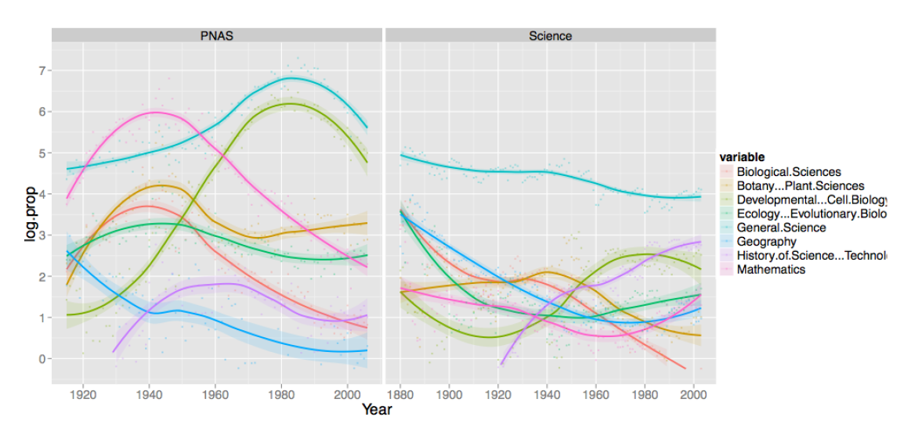
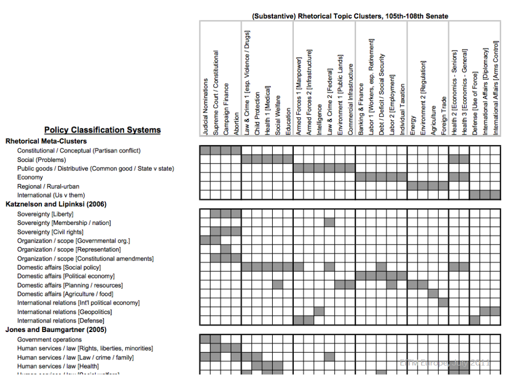

```{r setup, include=FALSE}
knitr::opts_chunk$set(collapse = T, cache=T, fig.align= "center", message = F,
                      warning = F, mysize=T, size='\\footnotesize')
knitr::knit_hooks$set(mysize = function(before, options, envir) {
  if (before) 
    return(options$size)
})
```

## Today's outline

- Final project expectations
- Topic Models
- Wrapping up

## Final project expectations

- Develop an interesting (non-trivial) research question (10)

    + Trivial: Did the CDU move to the left under Angela Merkel?
    + Less trivial: Did the CDU move to the left on every issue under Angela Merkel?
    + Non-trivial: Is there a general shift to the left among conservative parties in Europe on all policy issues?
    + The RQ does not need to contain a causal link (but it can)
    + Motivate your RQ
    
- Collect appropriate (text) data to answer your research question (25)  

    + Data needs to fit the research question (explain why it does)
    + Trivial: Use build-in datasets in R (e.g. inauguration speeches)
    + Less trivial: Download or access pre-existing datasets (e.g. manifestos)
    + Non-trivial: Construct your own data set (e.g. Twitter, News Media, Press releases)
    
- Prepare your data set for analysis (15)

    + Perform the necessary preprocessing steps and create a dfm

- Specify and apply the appropriate computarized text analysis techniques (25) 

    + must be a variant of a dictionary, wordscore, wordfish, or topic modelling

- Present and discuss your results (25)

    + Appropriate graphical presentations of results (watch out for the quality of graphs)


- ~8 pages (more is not an issue) detailing research question, data set, model specification, analysis and results

- team-work is encouraged
- Due 15 May


## Topic models: basic idea

We often have collections of documents that we’d like to divide into natural groups so that we can understand them separately. Topic modeling is a method for unsupervised classification of such documents, which finds natural groups of items even when we’re not sure what we’re looking for.

- Topic models are exploratory probability models that

    + weaken the contraints required in dictionary based content analysis
    + have been intensively studied in the computer science literature 

- Topic models work best with large amounts of text with a thematic structure

## Topic models: LDA

Latent Dirichlet allocation (LDA) is a popular method for fitting a topic model. It treats each document as a mixture of topics, and each topic as a mixture of words. 

```{r, out.width = "220px", echo = F}
knitr::include_graphics("img/lda1.png")
```  

## Topic models: LDA (II)

```{r, out.width = "250px", echo = F}
knitr::include_graphics("img/lda2.png")
```  

## Topic models: LDA (III)

```{r, out.width = "250px", echo = F}
knitr::include_graphics("img/lda3.png")
```  

## Topic models: LDA (IV)

```{r, out.width = "250px", echo = F}
knitr::include_graphics("img/lda4.png")
```  

## Topic model: LDA (V)

- Topic models giveth:

    + a probabilistic view of the relationship between W, Z and $\theta$
    + a full statistical framework for learning most aspects of the relationship

- and taketh away:

    + substantive control: You do not get to assert what the topics mean (inevitable when the Z and $\theta$ are both unobserved)

## Topic model: LDA (VI)

- What control is left?

    + $\alpha$ the parameter of a Dirichlet prior for the distributions (not number) of topics
    + $\eta$ the parameter of a Dirichlet prior over the distributions of words in topics

- Roughly, larger values allow more variation and less sparse representations
- Topic models are admixtures: mixtures of mixtures


## Variations: dynamic topic models (II)

```{r, out.width = "250px", echo = F}

```  

- Quinn et al. analyze 118,065 such congressional speeches from
1997-2004.

- $\theta$ has Markovian dynamics for smooth movement in topic proportions.
- Note: This does not allow variation in the way topics are expressed in
words

## Application: policy agenda

```{r, out.width = "230px", echo = F}
knitr::include_graphics("img/policyagenda.png")
```  

## Defining topics

```{r, out.width = "250px", echo = F}
knitr::include_graphics("img/definingTopics.png")
```  

## Defining topics (II)

```{r, out.width = "230px", echo = F}
knitr::include_graphics("img/clustering.png")
``` 

## Defining topics (III)

```{r, out.width = "250px", echo = F}

``` 

## Variations: expressed agenda model

In a simpler variation on LDA, Grimmer (2009) defines an expressed agenda model as

```{r, out.width = "250px", echo = F}
knitr::include_graphics("img/grimmer.png")
``` 

- Here there are not multiple topics per press release, but there are
observed authors drawn from a population

## Variations: correlated topic models

- The Dirichlet multinomial assumptions hide a constraint about topic
covariation

    + LDA cannot represent free covariation of topic proportions
    + The correlated topic model can

- Replace the Dirichlet with a Logistic Normal structure (Aitchison, 1986)
with arbitrary covariance matrix

## Topic models in R

- `topicmodels`

    + LDA & CTM

-     
    
## Text analysis workflow

```{r, out.width = "250px", echo = F}
knitr::include_graphics("img/textanalysis.png")
``` 
