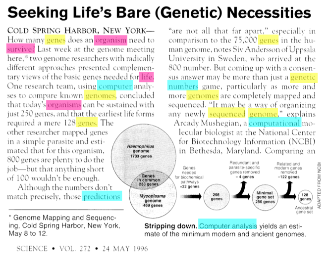
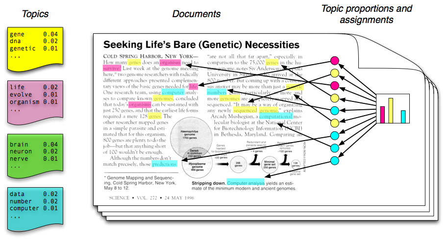
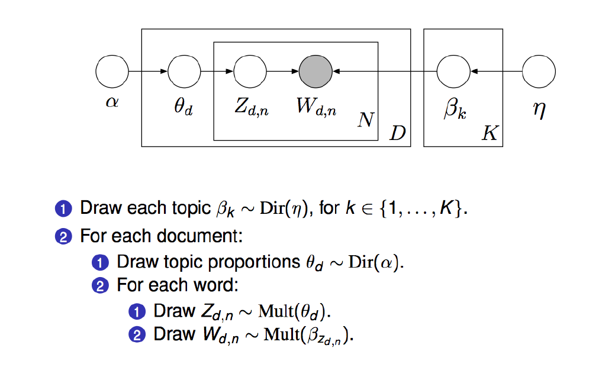
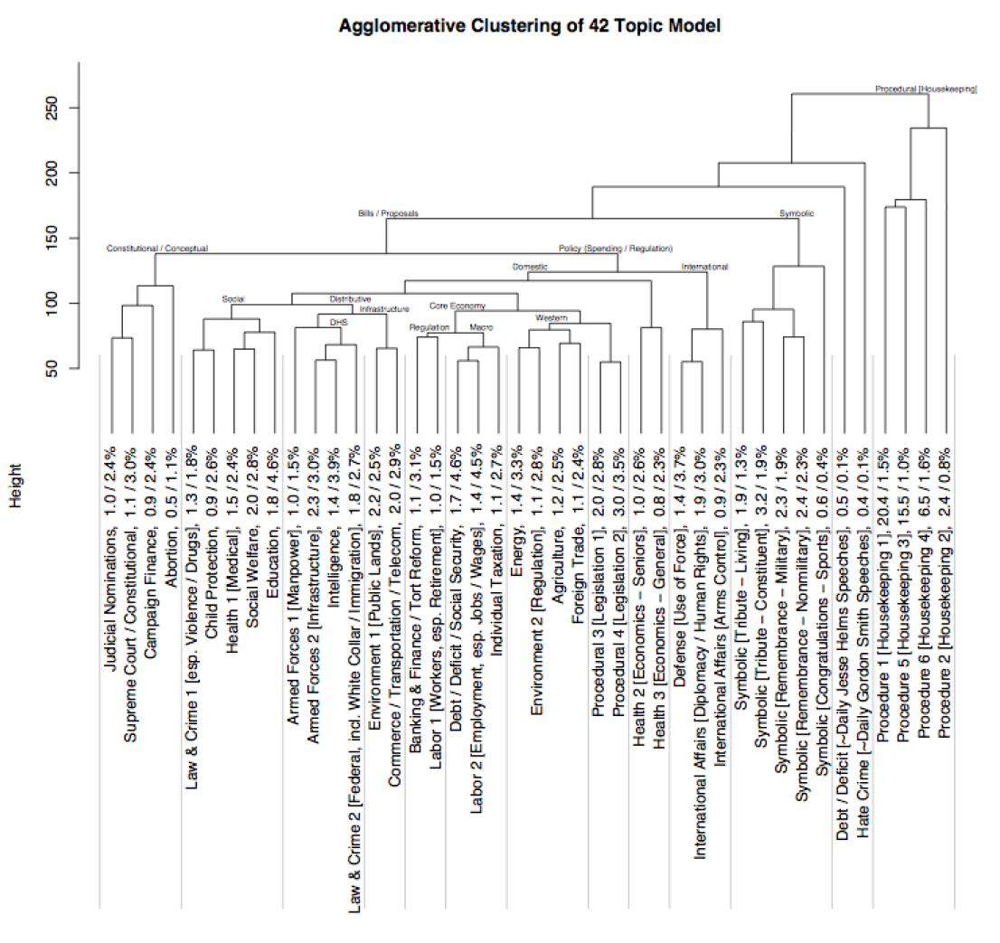
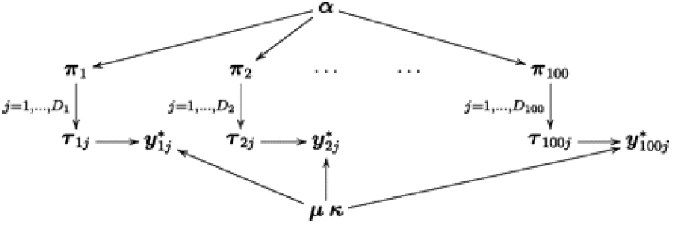

```{r setup, include=FALSE}
knitr::opts_chunk$set(collapse = T, cache=T, fig.align= "center", message = F,
                      warning = F, mysize=T, size='\\footnotesize')
knitr::knit_hooks$set(mysize = function(before, options, envir) {
  if (before) 
    return(options$size)
})
```

## Today's outline

- Final project expectations
- Topic Models
- Wrapping up

## Final project expectations

- Develop an interesting (non-trivial) research question **(10)**

    + Trivial: Did the CDU move to the left under Angela Merkel?
    + Less trivial: Did the CDU move to the left on every issue under Angela Merkel?
    + Non-trivial: Is there a general shift to the left among conservative parties in Europe on all policy issues?
    + The RQ does not need to contain a causal link (but it can)
    + Motivate your RQ
    
- Collect appropriate (text) data to answer your research question **(25)**  

    + Data needs to fit the research question (explain why it does)
    + Trivial: Use build-in datasets in R (e.g. inauguration speeches)
    + Less trivial: Download or access pre-existing datasets (e.g. manifestos)
    + Non-trivial: Construct your own data set (e.g. Twitter, News Media, Press releases)


## Final project expectations (II)
    
- Prepare your data set for analysis **(15)**

    + Create a corpus
    + Perform the necessary pre-processing steps and create a dfm

- Specify and apply a computarized text analysis method **(25)** 

    + must be a variant of a dictionary, wordscore, wordfish, or topic modelling

- Present and discuss your results **(25)**

    + Appropriate graphical presentations of results (watch out for the quality of graphs)


## Final project expectations (III)

**Deliverables**

- ~8 pages (more is not an issue) detailing research question, data set, model specification, analysis and results
- Replication code and data set

- team-work is encouraged
- Due 15 May


## Topic models: basic idea

We often have collections of documents that we’d like to divide into natural groups so that we can understand them separately. Topic modeling is a method for unsupervised classification of such documents, which finds natural groups of items even when we’re not sure what we’re looking for.

- Topic models are exploratory probability models that

    + weaken the contraints required in dictionary based content analysis
    + have been intensively studied in the computer science literature 

- Topic models work best with large amounts of text with a thematic structure

## Topic models: LDA

Latent Dirichlet allocation (LDA) is a popular method for fitting a topic model. It treats each document as a mixture of topics, and each topic as a mixture of words. LDA estimats both of these at the same time.

```{r, out.width = "220px", echo = F}

```  

## Topic models: LDA (II)

```{r, out.width = "250px", echo = F}

```  

## Topic models: LDA (III)

```{r, out.width = "250px", echo = F}
knitr::include_graphics("img/lda3.png")
```  

## Topic models: LDA (IV)

```{r, out.width = "250px", echo = F}

```  

## Topic model: LDA (V)

- Topic models giveth:

    + a probabilistic view of the relationship between W, Z and $\theta$
    + a full statistical framework for learning most aspects of the relationship

- and taketh away:

    + substantive control: You do not get to assert what the topics mean (inevitable when the Z and $\theta$ are both unobserved)

## Topic model: LDA (VI)

- What control is left?

    + $\alpha$ the parameter of a Dirichlet prior for the distributions (not number) of topics. The closer $\alpha$ is to 0 the more each document will tend to contain instances of fewer rather than more topics
    + $\eta$ the parameter of a Dirichlet prior over the distributions of words in topics. The closer $\eta$ is to 0 the more a topic will generate fewer words with high probability.

- Roughly, larger values allow more variation and less sparse representations
- Topic models are admixtures: mixtures of mixtures


## Application: policy agenda
- Quinn et al. analyze 118,065 congressional speeches from
1997-2004.

```{r, out.width = "195px", echo = F}
knitr::include_graphics("img/policyagenda.png")
```  

## Defining topics

```{r, out.width = "250px", echo = F}
knitr::include_graphics("img/definingTopics.png")
```  

## Defining topics (II)

```{r, out.width = "230px", echo = F}

``` 


## Variations: expressed agenda model

In a simpler variation on LDA, Grimmer (2009) defines an expressed agenda model as

```{r, out.width = "250px", echo = F}

``` 

- Here there are not multiple topics per press release, but there are
observed authors drawn from a population

- R: ``install_github("christophergandrud/ExpAgenda")``

## Variations: correlated topic models

- The Dirichlet multinomial assumptions hide a constraint about topic
covariation

    + LDA cannot represent free covariation of topic proportions
    + The correlated topic model can

- Replace the Dirichlet with a Logistic Normal structure (Aitchison, 1986)
with arbitrary covariance matrix

- R: ``topicmodels``


## Topic model example (from tidytextmining.com)

```{r}
library(topicmodels)
# browseVignettes('topicmodels')
data("AssociatedPress")
apLda <- LDA(AssociatedPress, control = list(seed = 1234), k = 2)
```

## Word-topic probabilities

```{r}
# extract the per-topic-per-word probabilities ('beta')
library(tidytext)
library(ggplot2)
library(dplyr)
apTopics <- tidy(apLda, matrix = "beta")

# Top 10 terms that are most common within each topic
topTerms <- apTopics %>%
  group_by(topic) %>%
  top_n(10, beta) %>%
  ungroup() %>%
  arrange(topic, -beta)
plotTerms <- topTerms %>%
  mutate(term = reorder(term, beta)) %>%
  ggplot(aes(term, beta, fill = factor(topic))) +
  geom_col(show.legend = FALSE) +
  facet_wrap(~ topic, scales = "free") +
  coord_flip()
```

## Word-topic probabilities (II)

```{r, out.width = "250px", echo=F}
plotTerms
```

## Words that discriminate well

- Extract terms with the greatest difference in $\beta$ between topic 1 and topic 2 using the log ratio $log_2(\frac{\beta_1}{\beta_2})$
    
```{r}
library(tidyr)
betaSpread <- apTopics %>%
  mutate(topic = paste0("topic", topic)) %>%
  spread(topic, beta) %>%
  filter(topic1 > .001 | topic2 > .001) %>%
  mutate(log_ratio = log2(topic2 / topic1))
head(betaSpread)
```

## Words that discriminate well (II) 

```{r}
plotBetaSpread <- betaSpread %>%
  mutate(absratio = abs(log_ratio)) %>%
  group_by(direction = log_ratio > 0) %>%
  top_n(10, absratio) %>%
  ungroup() %>%
  mutate(term = reorder(term, log_ratio)) %>%
  ggplot(aes(term, log_ratio)) +
  geom_col() +
  labs(y = "Log2 ratio of beta in topic 2 / topic 1") +
  coord_flip()
```


## Words that discriminate well (III)

```{r, out.width = "250px", echo=F}
plotBetaSpread
```

## Document-topic probabilities

- LDA  models each document as a mixture of topics so we can examine the per-document-per-topic probabilities($\gamma$)

```{r}
apDocs <- tidy(apLda, matrix = "gamma")
head(apDocs)
```


## Document-topic probabilities (II)
```{r}
# Inspect document 6
tidy(AssociatedPress) %>%
  filter(document == 6) %>%
  arrange(desc(count))
```

## Topic model exercise

We will take another look at the US Senate debate on partial birth abortion.

1. Download the speeches from Moddle (if you use Github you should have them inside the Week12 folder) and load them into R.  

2. We dont have very large numbers of speeches, but we can do a topic analysis using paragraphs as documents. Load `quanteda`, construct a corpus object and use the `corpus_segment` function to split the documents into paragraphs.

3. Use `dfm` to construct a document-feature matrix out of the paragraphs. Convert everything to lowercase, remove numbers, symbols and english stopwords.

4. Use `convert` to convert the dfm to a topicmodel object.

5. Estimate a lda model using the `LDA` function from the `topicmodel` package and set the number of topics to 6 and $\alpha$ to 0.1.

6. Create a plot of the top 10 terms that are most common within each topic.

## Topic model exercise solution

```{r}
library(quanteda)
library(readtext)
library(topicmodels)
wdir <- getwd()
speechCorpus <- corpus(readtext(paste0(wdir, "/usSenateDebate/*.txt")))
speechCorpusPara <- corpus_segment(speechCorpus, what = "paragraphs")
myDfm <- dfm(speechCorpusPara, tolower = T,  
                 removeNumbers = T, removeSymbols = T, 
                 remove = stopwords("english"))
ldaDfm <- convert(myDfm, to = "topicmodels")
speechLda <- LDA(ldaDfm, control = list(alpha = 0.1, seed = 1234), k = 6)
```

## Topic model exercise solution (II)

```{r}
library(tidytext)
library(ggplot2)
library(dplyr)
apTopics <- tidy(speechLda, matrix = "beta")
topTerms <- apTopics %>%
  group_by(topic) %>%
  top_n(10, beta) %>%
  ungroup() %>%
  arrange(topic, -beta)
plotTerms <- topTerms %>%
  mutate(term = reorder(term, beta)) %>%
  ggplot(aes(term, beta, fill = factor(topic))) +
  geom_col(show.legend = FALSE) +
  facet_wrap(~ topic, scales = "free") +
  coord_flip()
```


## Topic model exercise solution (III)

```{r, out.width = "250px", echo=F}
plotTerms
```

## Quantitative Text Analysis in R

**Take home messages**

- There is an abundant amount of text data in the social sciences
- Generating inferences from these data frequently requires computers and algorithms
- Various computerized methods exists to quantify and analyze text
- Everything can be done in R using a handful of packages


## Quantitative Text Analysis in R (II)

**You should be able to**

- ... interact and manipulate text data in R
- ... classify documents into categories
- ... scale documents in a unidimensional space
- ... understand the theory behind the text classification functions
- ... create appealing visualizations
- ... access interesting text data sources using APIs and other ways
- ... (scrape data off the internet)


## Quantitative Text Analysis in R (III)

**What to improve**

- Working alongside the slides
- Clearer expectations regarding the assignments
- Better balance between theory and practice
- Incorporate YOUR interests more
- ...

