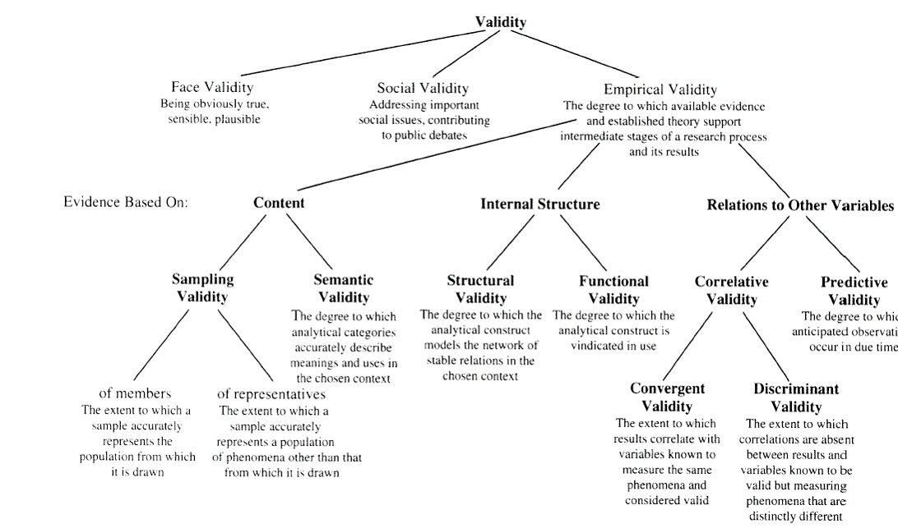
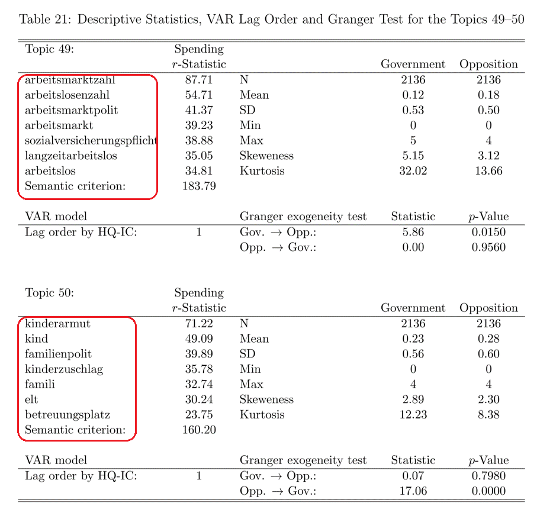
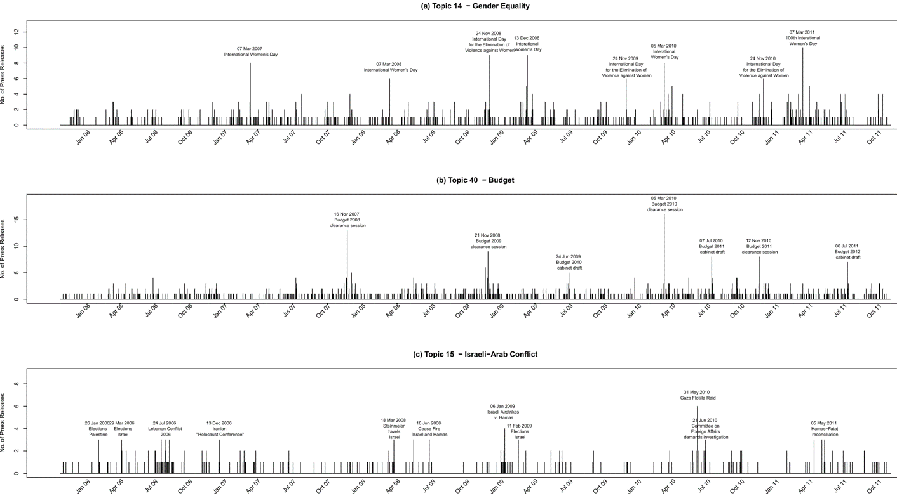
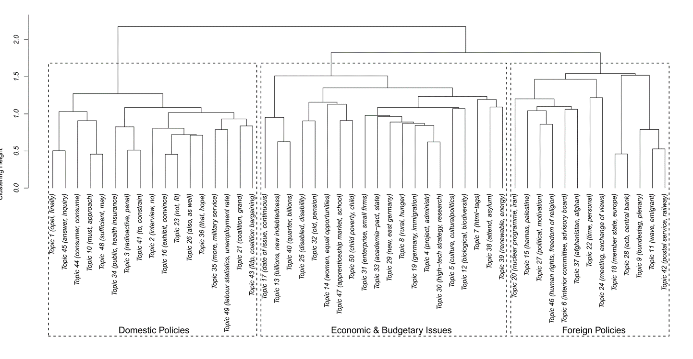

```{r setup, include=FALSE}
knitr::opts_chunk$set(echo = FALSE)
```


## Assignment 1

- Factors in `mpData::wkrnr` are the same as factors in `GLESS::wkrnr`

    + GLES does not have respondents in every district
    
- Use `lm()` and `glm()` (!set family) to fit linear and logistic models

- Create nice looking tables with `stargazer` (more today)

    + Figures are a plus

- 2 Page description/summary (next week in class, email .R code)


## Today's Outline

- Finishing up R introduction
  
    + Plotting
    + Tabulation
    + Tidy data
    + `dplyr`
    
- Concepts in QTA: Validity & Reliability


## Plotting with R

R has a powerful graphics engine to produce high quality graphs e.g.:

- `plot`: Basic plotting function (e.g. for scatterplots)
- `hist()`: Histograms
- `dotchart()`: Dot plots
- `boxplot()`: Box-and-whisker plots

## Histograms
```{r, echo=T, fig.width= 4, fig.height = 3.5}
# Create a histogram
data(swiss)
hist(swiss$Fertility, freq=FALSE, main="Fertility Rates")
```

## Dotchart

```{r, echo=T, fig.width= 6, fig.height = 3.5}
# Create a dot plot
data(swiss)
dotchart(swiss[1:5,2], labels=rownames(swiss))
```


## Plotting with ggplot2
R has several systems for making graphs, but `ggplot2` is one of the most elegant and most versatile. `ggplot2` implements the grammar of graphics, a coherent system for describing and building graphs.

- Each plot is made of layers. Layers include the coordinate system (x-y), points, labels, etc.
- Each layer has aesthetics (`aes`) including x & y, size, shape, and color.
- The main layer types are called geometrics(`geom`) and include
lines, points, etc.


## ggplot2 example
```{r, echo = T, fig.width= 5, fig.height = 2.4}
library(ggplot2)
ggplot(data = mpg) + 
  geom_point(mapping = aes(x = displ, y = hwy))
```


## ggplot2 customization: color
```{r, echo = T, fig.width= 5, fig.height = 2.4}
library(ggplot2)
ggplot(data = mpg) + 
 geom_point(mapping = aes(x = displ, y = hwy, color = class))
```


## ggplot2 customization: theme
```{r, echo = T, fig.width= 5, fig.height = 2.4}
library(ggplot2)
ggplot(data = mpg) +  theme_bw() +
 geom_point(mapping = aes(x = displ, y = hwy, color = class))
```


## Tabulation

There are a number of ways to generate tables in R. Two useful tools that are good to know are: 

- `kable`: for creating tables from data frames
- `stargazer`: for creating tables of regression model output

In R, models are fit using the adequate functions e.g. `lm()` for OLS. Many models are packaged in one function, e.g. logistic regression is used with the `glm()` (generalized linear model) function by specifying the model type.


## kable
```{r, echo = T}
library(knitr)
kable(head(mtcars[,1:6]), digits = 2)
```


## stargazer

`kable` is limited if we want to create regression output tables, especially for multiple models. `stargazer` is good for this. `stargazer` can output tables in various formats. 

To export a table to word document use: `type = 'html'`.


## stargazer example
```{r, echo=T, message=F, eval=F}
library(stargazer)
# Run regressions
output <- lm(rating ~ complaints + privileges + learning 
                        + raises + critical, data=attitude)
output2 <- lm(rating ~ complaints + privileges + learning,
              data=attitude)

# Create table
stargazer(output, type="html", 
          out="attitude.htm")
```


## stargazer example


## Tidy data

Most of the time data sets have to be cleaned before you can run statistical analyses on them. To help streamline this process Hadley Wickham laid out principles of data tidying which links the physical structure of a data set to its meaning (semantics).

- In tidy data:

    + Each variable is placed in its own column
    + Each observation is placed in its own row
    + Each type of observational unit forms a table
    

## Tidy data (II)

**Not tidy**:

| Person       |  treatmentA | treatmentB |
| ------------ | ----------- | ---------- |
| John Smith   |             | 2          |
| Jane Doe     | 16          | 11         |

**Tidy**:

| Person       |  treatment  | result     |
| ------------ | ----------- | ---------- |
| John Smith   | a           |            |
| Jane Doe     | a           | 16         |
| John Smith   | b           | 2          |
| Jane Doe     | b           | 11         |


## Messy to tidy data

```{r, echo = T}
# Create messy data
messy <- data.frame(
  person = c("John Smith", "Jane Doe"), 
  a = c(NA, 16), b = c(2, 11))
# Gather the data into tidy format
library(tidyr)
tidy <- gather(messy, treatment, result, a:b)
tidy
```


## Merging data

Once you have tidy data frames, you can merge them for analysis. Each observation must have a unique identifier to merge them on.

```{r, echo = T}
data(swiss)
swiss$ID <- rownames(swiss) # Create ID
df <- merge(swiss[,c(1:3,7)], swiss[,4:7], by = "ID")
```


## Appending data

You can also add observations to a data frame.

```{r, echo = T}
data(swiss)
df <- swiss[1:3,1:3]
df2 <- rbind(df, swiss[4,1:3])
df2
```


## Using dplyr

The `dplyr` package has powerful capabilities to manipulate data frames quickly.

```{r, echo=T, warning=F, message = F}
library(dplyr)
data(swiss)
swiss$ID <- rownames(swiss) # Create ID
df <- dplyr::filter(swiss, Fertility > 90) %>% 
  dplyr::select(ID, Fertility, Catholic)
df
```


## Piping

Piping allows to pass a value forward to a function call and produces faster compilation and enhanced code readability. In `R` use `%>%` from the `dplyr` package.


```{r, echo = T}
# Not piped:
values <- rnorm(1000, mean = 10)
value_mean <- mean(values)
round(value_mean, digits = 2)
```

```{r, echo = T, message=F}
# Piped:
library(dplyr)
rnorm(1000, mean = 10) %>% mean() %>% round(digits = 2)
```


## Quantitative text analysis (QTA)

- Numerical/quantitative representation of text

    + Quantitative measures
    + Mostly based on word frequencies
    + Analysis using quantitative methods

- Two approaches:

    + 'Classical' QTA: Hand coding (next two sessions)
    + Computerized analysis with varying degrees of user input (remainder of class)


## Motivation for QTA

Text contains political positions, conflict, issue importance, valence and much more. Concepts of interest are often not stated directly but are hidden/latent in text. Text analysis helps to uncover the latent concepts, e.g.

- Where do parties position as compared to other parties?

    + Analyze parties‘ manifestos and code the number of times the party demands leftist or rightist policies: Comparative Manifestos Project CMP; Scaling

- What issues do legislators (or parties) emphasize in their communication?

    + Collect their press releases and categorize them according to their thematic content: Comparative Agendas Project (CAP); Clustering


## Concepts in QTA

| Concept     | Meaning                  |
| ------------      | ----------------------------------------------------- |
| Replicability     | Can measurements be repeated?            |
| Uncertainty      | How large are variations in measurements?   |
| Precision     | How exact are measures derived from a procedure?         |
| Validity   | Does a measurement represent the reality of what is being measured?            |
| Reliability      | Do repeated measurements produce stable results?    |


## Reliability & Validity

**Reliability:**

- Are measures that are derived from text analysis stable when repeated?
- Several ways to measure/test for reliability

**Validity:**

- Does the text analysis measure what it is supposed to measure
- Dependent on human judgement: 'plausibility checks'
- Established case-specifically


## Validity

The extent to which an empirical measure adequately reflects what humans agree on as the real meaning of a concept (Babbie 1995). Validity is usually established using one (or several) sub-forms of validity:


**Face Validity:** Data plausibly represent a certain concept

- Plausibility requires results with a 'high rate of inter-subjective consent'

**Criterion Validity:** Data agree with some external, established standard

- Concurrent criterion validity
- Predictive criterion validity
- Requires consensus on standards: Hard to establish in QTA


## Validity (II)

**Content Validity:** Measure captures the full width of a concept

**Construct Validity:** Measure agrees with other measures in a theoretically expected manner

- Cross-validation with independent measures

**External Validity:** Generalizability of findings in other contexts


## An example validation


Quantifying parties‘ issue attentions in press releases:	

- Collection of ~42000 press releases from the 16th and 17th Bundestag 

- Which parties emphasize which topic in their press releases?

- Clustering/Topic model (see week 12)

    + counts the frequencies of word occurences
    + 'groups' documents into clusters, i.e. sets of docs that use similar words
    + generates labels based on most characteristic words for each cluster


## Validation strategies (Krippendorff)?




## Types of validation (Krippendorff)


## How to validate the clustering?

- Look at the overall composition of the clusters

    + What clusters would you expect to find?
- Look at the size of the clusters over time

    + When should clusters be smaller/larger?
- Look at relations between clusters

    + Which would you expect to relate closely/less closely to each other?


## Overall composition




## Predictive validity



## Relations between clusters




## Reliability

_The extent to which a research procedure yields the same results on repeated trials (Carmines and Zeller 1979)._

- Unreliabel procedures deliver meaningless results:

    + with low reliability all validity is basically coincidence
    + reliability is an upper bound for validity

- The more relevant the more human judgement is involved

- Usually concordance between two or more human coders


## Reliability (II)

Designs for measuring reliability by measurement:

| Type     | Test Design  | Causes of Disagreement | Strength |
| ------------- | --------------| --------------------------------| ------- |
| Stability     | test-retest | intraobserver inconsistencies | weakest |
| Reproducibility  | test-test | intraobserver inconsistencies + intraobserver disgreements | medium |
| Accuracy | test-standard |  intraobserver inconsistencies + intraobserver disgreements + deviations from standard | strongest |


## Reliability checks 

- Reliability checks in the Comparative Manifestos Project (week 6)

    + Coders repeat own coding (stability)
    + Coders repeat other coders' codings (reproducibility)
    + Coders code 'gold standard' (accuracy)


## How to calculate reliability?

- Percentage of agreements
- Correlations (Pearson/Spearman)

- Agreements by coincidence?

    + Frequency of coincindental agreements depends on the number of categories into which units are being coded
    + Number of coders


## Krippendorff's $\alpha$

Simple example from Krippendorff (2004):

- Ten units (e.g. newspaper articles) to be coded by two coders
- Binary choice (e.g. mentions the USA or not)

| Article     | 1 | 2 | 3 | 4 | 5 | 6 | 7 | 8 | 9 |10 |
| --------    | --| --| --| --| --| --| --| --| --| --| 
| Coder A     | 1 | 1 | 0 | 0 | 0 | 0 | 0 | 0 | 0 | 0  | 
| Coder B     | 0 | 1 | 1 | 0 | 0 | 1 | 0 | 1 | 0 | 0  | 


## Krippendorff's $\alpha$ (II)

Krippendorff's $\alpha = 1 - \frac{D_0}{D_E}$

- $D_0$: Number of observed disagreements
- $D_E$: Number of expected disagreements
- $\alpha$: Agreement exceeding expected (coincidental) agreement
- $\alpha \geq 0.66$ is considered good reliability

    + … reality is different – see sessions on CMP next week


## Calculating Krippendorf‘s $\alpha$ in R

```{r, echo = T, message=F}
library(irr)
data(video)
video[1:2,]
kripp.alpha(t(video)) # Input is a coding frame
```


## Next week

- Classical hand coding/CMP
