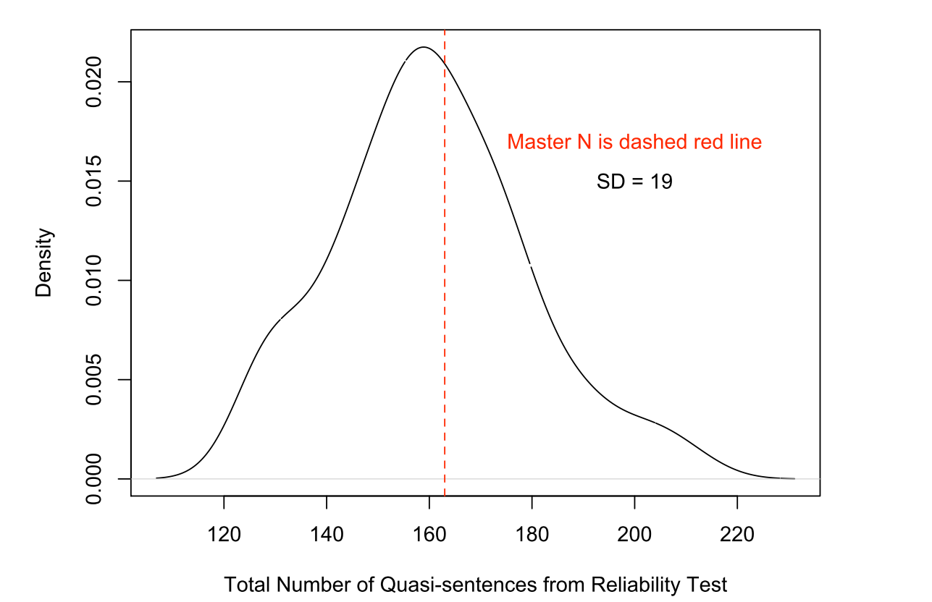

```{r setup, include=FALSE}
knitr::opts_chunk$set(echo = FALSE)
```


## Today's Outline

- Krippendorff's $\alpha$ by hand
- Classical hand coding/CMP


## Krippendorff's $\alpha$ example

Simple example from Krippendorff (2004):

- Ten units (e.g. newspaper articles) to be coded by two coders
- Binary choice (e.g. mentions the USA or not)

| Article     | 1 | 2 | 3 | 4 | 5 | 6 | 7 | 8 | 9 |10 |
| --------    | --| --| --| --| --| --| --| --| --| --| 
| Coder A     | 1 | 1 | 0 | 0 | 0 | 0 | 0 | 0 | 0 | 0  | 
| Coder B     | 0 | 1 | 1 | 0 | 0 | 1 | 0 | 1 | 0 | 0  | 


## Calculating Krippendorff's $\alpha$ by hand
**Direct computation:** $$\alpha = 1 - (n-1) \frac{0_{01}}{n_1 * n_0}=1-19*\frac{4}{84}=0.095$$

**Conceptual computation:**

*Step 1: Create contingency matrix*

|             | 0  | 1 | 
| ------------| -- | --|
| 0           | 10 | 4 | 
| 1           | 4  | 2 |  
| # of values | 14 | 6 |

## Calculating Krippendorff's $\alpha$ by hand (II)

*Step 2: Create matrix of expected coincidences*

- Assume one random process to create the coding results:

    + Use the number of values as the distribution to draw from: 20 balls with 6 labelled as '1' and 14 labelled '0'

- Calculate the expected number of results:

$$e_{01} = \frac{n_0}{n} * \frac{n_1}{n-1} * n; e_{01} = 4.42$$

|             | 0   | 1   | 
| ------------| --- | --- |
| 0           | 9.6 | 4.4 | 
| 1           | 4.4 | 1.6 |  
| # of values | 14  | 6   |

## Calculating Krippendorff's $\alpha$ by hand (II)

*Step 3: Use the conceptual form of* $\alpha$

- $\alpha = 1 - \frac{D_0}{D_E}; D_0=4; D_E = 4.4$

- $\alpha = 1 - \frac{D_0}{D_E} = 1- \frac{4}{4.42} = 0.095$

```{r, echo = T, message=F}
library(irr)
a=c(1,1,0,0,0,0,0,0,0,0)
b=c(0,1,1,0,0,1,0,1,0,0)
rd=rbind(a,b)
kripp.alpha(rd)
```


## Spatial models and saliency

**Saliency theory to party competition** 

- "In multidimensional issue competition, parties may compete not by converging to similar positions but, rather, by emphasizing the importance/salience of the distinct issues which give them the advantage with the voters." (Grofman 2003)

- "[…] parties compete by accentuating issues on which they have an undoubted advantage, rather than by putting forward contrasting policies on the same issues." (Budge et al. 1987)


## Classical content analysis: Hand coding

**Key features**

- Human Coders
- Predefined coding scheme
- Coders read and code text elements

**Differences to other approaches**

- Human judgement is central element
- Dictionary approaches (Week 9) use human input for creating dictionaries, hand coding judges text elements directly


## Work flow of hand coding

1. Unititing

    + Splitting text in units to be coded
    
2. Coding

    + Classification of the text units created in the previous step

3. Summarizing

    + Counting of the numbers of codes appearing in the texts (and generating measures)
    
4. Reliability testing

    + Checking reliability (usually between coders)


## Comparative Manifestos Project (CMP)

The CMP was originally created by Ian Budge und David Robertson in 1979.

- Sampling Units: Party manifestos

    + All democratic elections after WW2
    + Full census (intended)
    + $>$ 50 countries

    
## Unitizing

- Unitization: Systematically distinguish text segments/recording units relevant for the analysis

    + Words, sentences, paragraphs, pages, chapters…
    + Quasi-Sentence

- Unitizing/Recording unit in the CMP: Quasi sentence 

    + "an argument or phrase which is the verbal expression of one political idea or issue" (Klingemann 2006)


## Unitizing: CMP „Quasi-Sentences“

**Identifying quasi sentences**

- Natural sentence as starting reference
- Natural sentences are split, if they include two or more seperate ideas/issues
- Quasi sentence ends either with a change in argument or on a period


## Unitizing: Conservative Party UK 2015

**We will rebalance our economy and build a Northern Powerhouse**

We are committed to a truly national recovery, benefiting all parts of our country. We have devolved powers to Scotland and Wales, and set out long-term economic plans to raise the growth rate of all parts of England, bringing areas which have grown more slowly up to at least the national average. Over the last year, the North grew faster than the South. By connecting up the North with modern transport links, we will enable its great cities and towns to pool their strengths. We will invest a record £13 billion in transport for the North. We will electrify the main rail routes, build the Northern Hub, and provide new trains for the North. We will upgrade the A1, M62, M1 and A555 link road. And that is on top of our £50 billion commitment to build High Speed 2 – the new North-South railway linking up London with the West Midlands, Leeds and Manchester – and develop High Speed 3 to join up the North.


## Unitizing: Conservative Party UK 2015 (II) 

**We will rebalance our economy and build a Northern Powerhouse** \textcolor{red}{|}

We are committed to a truly national recovery, benefiting all parts of our country. \textcolor{red}{|} 
We have devolved powers to Scotland and Wales, \textcolor{red}{|}
and set out long-term economic plans to raise the growth rate of all parts of England, bringing areas which have grown more slowly up to at least the national average. \textcolor{red}{|}
Over the last year, the North grew faster than the South. \textcolor{red}{|}
By connecting up the North with modern transport links, we will enable its great cities and towns to pool their strengths. \textcolor{red}{|}
We will invest a record £13 billion in transport for the North. \textcolor{red}{|}
We will electrify the main rail routes, build the Northern Hub, and provide new trains for the North. \textcolor{red}{|}
We will upgrade the A1, M62, M1 and A555 link road. \textcolor{red}{|}
And that is on top of our £50 billion commitment to build High Speed 2 – the new North-South railway linking up London with the West Midlands, Leeds and Manchester \textcolor{red}{|}
– and develop High Speed 3 to join up the North. \textcolor{red}{|}


## Unitizing: CMP-Training

- In training CMP coders unitize and code a manifesto that is coded as a "gold standard"

    + Enables comparing the coders' unitizing to what the PIs intended
    + Applies to "gold standardized" text only

```{r, out.width = "200px"}

```


## Coding: General

- Task: Allocating each of the quasi sentences to one category of the coding scheme

- Coding scheme: Predefined set of categories with rules for when to use which category


## Coding: CMP

- Hierarchical structure
- Scheme has 56 categories grouped in 7 larger categories (policy domains)

    + Directed categories: Where appropriate there is categories for right and left statements
    + Not all categories have such a negation
    + 13 „left“ and 13 „right“ Categories
    + Codes are singular: Each quasi sentence gets one code


## Coding Conservative Party UK 2015

**We will rebalance our economy and build a Northern Powerhouse** \textcolor{red}{NA}

We are committed to a truly national recovery, benefiting all parts of our country. \textcolor{red}{601}
We have devolved powers to Scotland and Wales, \textcolor{red}{301}
and set out long-term economic plans to raise the growth rate of all parts of England, bringing areas which have grown more slowly up to at least the national average. \textcolor{red}{404}
Over the last year, the North grew faster than the South. \textcolor{red}{410}
By connecting up the North with modern transport links, we will enable its great cities and towns to pool their strengths. \textcolor{red}{410}
We will invest a record £13 billion in transport for the North. \textcolor{red}{411}
We will electrify the main rail routes, build the Northern Hub, and provide new trains for the North. \textcolor{red}{411}
We will upgrade the A1, M62, M1 and A555 link road. \textcolor{red}{411}
And that is on top of our £50 billion commitment to build High Speed 2 – the new North-South railway linking up London with the West Midlands, Leeds and Manchester \textcolor{red}{411}
– and develop High Speed 3 to join up the North. \textcolor{red}{411}


## Coding Conservative Party UK 2015: Gold standard

**Domain 3: Political System**

301 "Decentralisation: Positive"


**Domain 4: Economy**

404 "Economic Planning"

410 "Productivity: Positive" (2)

411 "Technology and Infrastructure: Positive" (5)


**Domain 6: Fabric of Society**

601 "National Way of Life: Positive"


## Summarizing

- Deriving theoretically meaningfull measures based on the occurence of the codes assigned in the previous step. e.g.:

    + Occurence of categories: Relative share of a policy domain in a manifest; Share devoted to the codes of the domain "Economy" measures salience of economic issues
    + Range/Variance: Number of overall employed categories may measure the bandwith of policies


## Summarizing: Rile Scale

**Saliency Theory/ Issue Ownership**

- Parties try to differentiate from their opponents 
- Compete by empasizing different issues

    + How frequently are certain policy domains discussed in the manifestos

- How frequently are those codes that are considered left or right used

    + Left/right assignment is not self-evident: Changes over time?
    + Rile-Skala: CMP's "crowning achievement" (Budge et al. 2001)
    

## Rile: Calculation

$Rile = \frac{R-L}{N}$

- $R, L, N$ = Right, left, total number of codes assigned
- Range [-100, 100]


Example: 200 Quasi Sentences, 40 right, 100 left

- Rile = -30


## Rile: Alternatives

**Disadvantages**

- Adding irrelevant text shifts RiLe towards 0, i.e. the middle
- Linear in increasing left and right codes

**Alternative 1 (Laver and Garry 2000):** $$\frac{R-L}{R+L}$$

- Linearity
- Range [-1,1]
- Solves irrelevant text and tendency to the middle


## Rile: Alternatives (II)

**Alternative 2 (Lowe et al. 2010):** $$\log\frac{R}{L}$$

- Middle: $\log(1)=0$
- Previous example: -0.916 (200 QS, 40 Right, 100 Left)
- Additional right/left codes enter logged: An additional right/left code shifts the scale stronger in the middle than in the extremes


## Next week

- Working with CMP data, challenges
