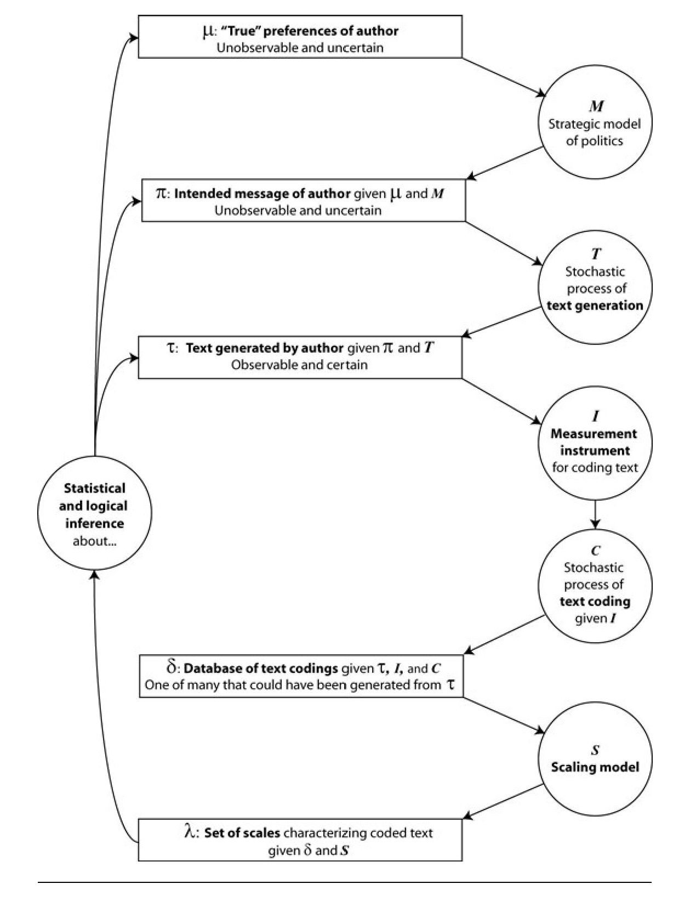
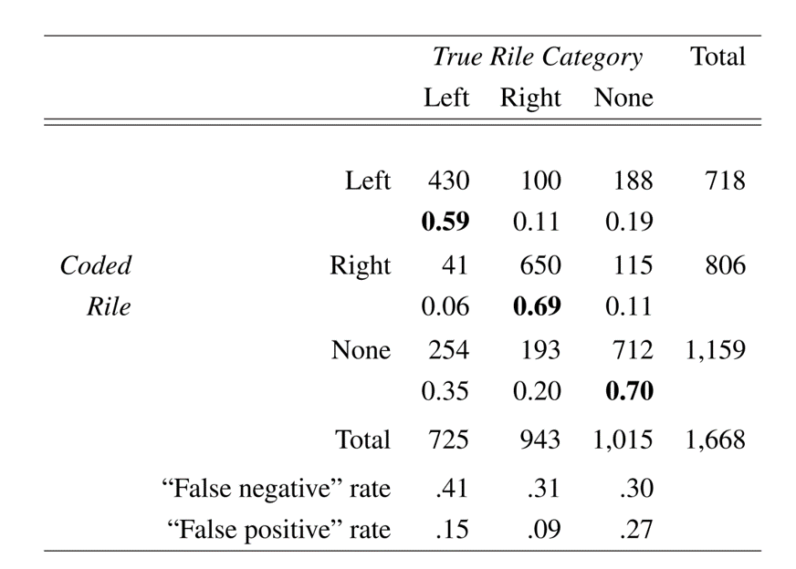
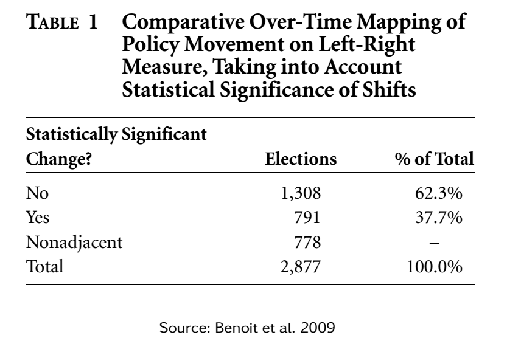
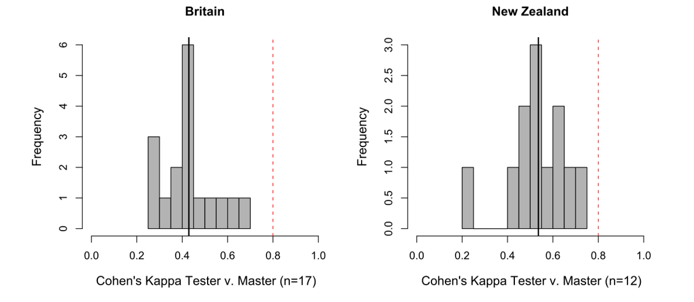
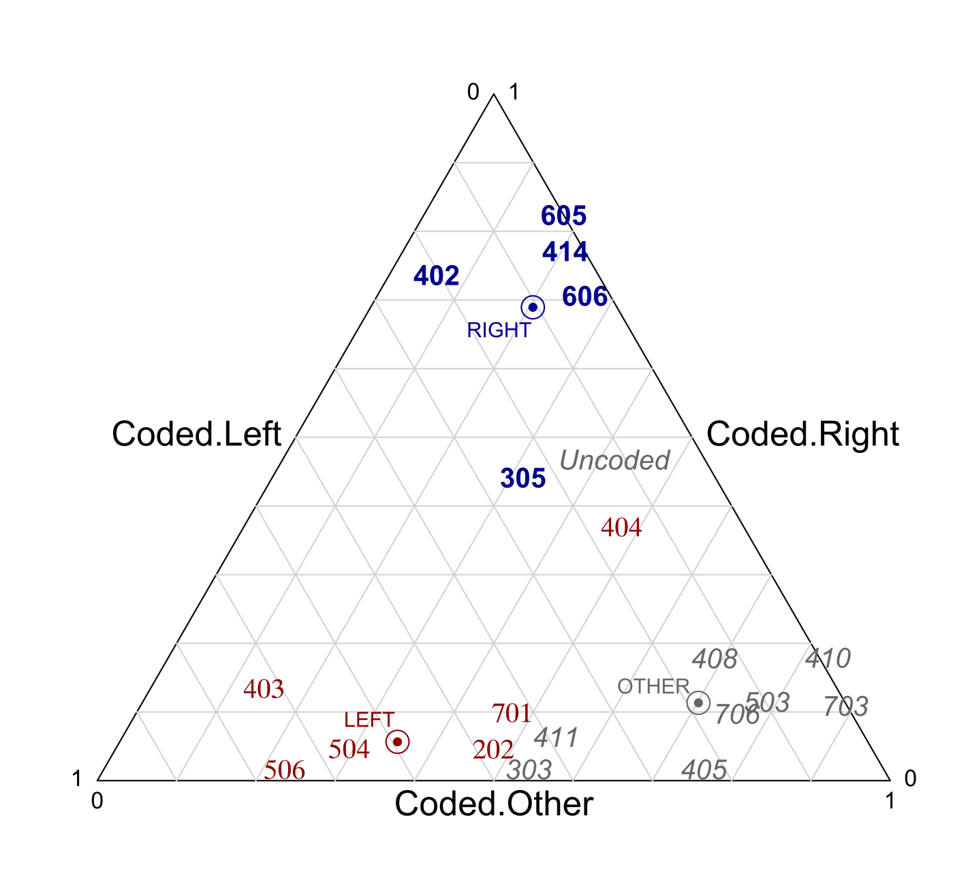
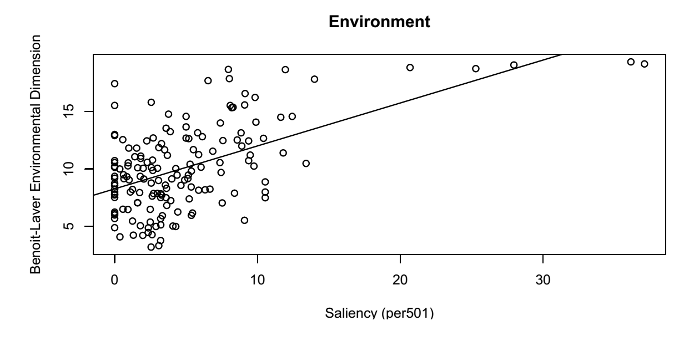
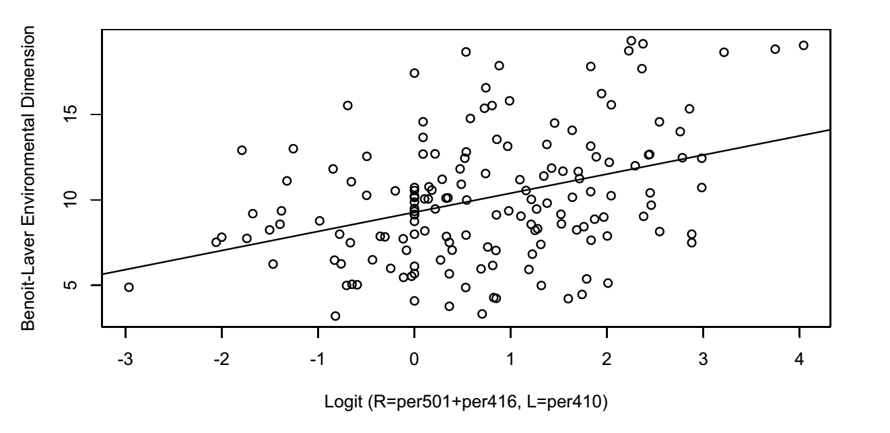
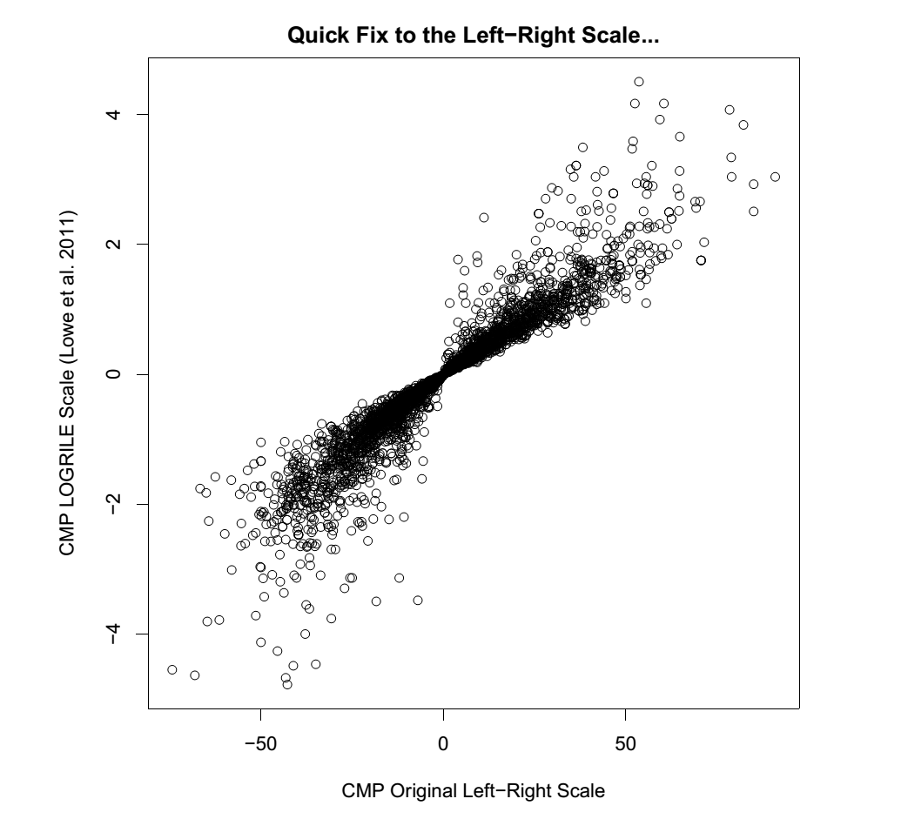

```{r setup, include=FALSE}
knitr::opts_chunk$set(echo = FALSE, fig.align= "center")
```


## Today's outline

- Assignment 1
- Coding Excercise
- CMP: Validity and reliability issues
- Assignment 2


## Coding exercise

Thank you for completing the coding exercise

- Overall inter-coder agreement: 0.245 (UKIP); 0.266 (Liberal)

    + (comparable to Mikhaylov et al. study – and that one included former coders – 0.35)
    
. . . and the QCA top coders are . . .


## Top coders

|                 | Kappa       | Party   | 
| --------------- | ----------  | ------- |
| Jeffrey         | .072        | UKIP    |
| Christopher     | .056        | UKIP    |
| Chiara          | .053        | UKIP    |
| Léa             | .041        | Liberal |
| Matthias K.     | .036        | Liberal |
| Akira           | .029        | Liberal |
| Robin           | .010        | UKIP    |
| Riccardo        | .000        | UKIP    |

Mikhailov et al.'s top coder: .72


## Manifesto Project (some) limitations

- Coding scheme developed in the 1980s applicable today?
- Measurement uncertainty?
- Reliability? How many categories can a human coder process?
- Validity?
- Left-right measure influenced by non-left right issues
- Fixed (but hidden) end points in L-R measure


## CMP coding scheme issues

**Misclassification problem**

- Ambuiguities and overlap in the coding scheme:

    + '401: Free enterprise: Favorable mentions of free enterprise capitalism; superiority of individual enterprise over state control systems…'
    + '402: Incentives: Need for wage and tax policies to induce enterprise'
    + '501: Environmental protection'

- CMP data are coded only once
- No estimate for the uncertainty resulting from the coding process


##  CMP coding scheme issues (II)

**The CMP‘s argument**

- Reliability exists for the data set as a whole

    + i.e. for the RiLe scale or where substantial sub-sets of the data are input together the data has high reliability and validity

- Misclassification should 'cancel out'

    + Miclassification within left/right/uncoded codes occur
    + Misclassification between the groups of codes should be rare

## Are misclassifications self cancelling?

**Mickhaylov et al. 2010**

- Texts used in CMP-training; 

    + Manifestos for UK and NZ
    + 'Gold-Standard'/'Master coding' gives 'true' coding

- Actual CMP-coders code manifestos 

    + 'Worst' 25% of coders are excluded in evaluation 
    + (GB: 17, NZ: 12)
    
- Coding of the two manifestos only uses ~20 of the 57 categories
- Correct unitizing is given for coders


## Stochastic text generation

```{r, out.width = "150px"}

```

## Stochastic text generation (II)

**Benoit, Laver, and Mikhaylov 2009**

- Text generation is stochastic

    + there are many different possible texts that could have been written to communicate the same position

- Idea: simulate those texts through non-parametric bootstrapping (sampling with replacement) of quasi-sentences

- Then generate uncertainty intervals for categories or some aggregate measure (e.g. Left-Right scale) from those simulated datasets

    + Issue of empty categories


## Measurement uncertainty

Movement on Environmental Policy of German CDU-CSU over Time

```{r, out.width = "250px"}

```

## Measurement uncertainty (II)

With those estimates of measurement uncertainty (reg. stochastic text generation), we can ask whether changes in party policy according to the CMP data are real or just noise?

```{r, out.width = "200px"}

```

## Reliability & Validity

**Reliability**

- Are measures that are derived from text analysis be stable when repeated?

**Validity**

- Does the text analysis measure what it is supposed to measure


## 1. Intercoder-reliability

**Intercoder-reliability**

- Agreement between coders calculated at

    + Full 56 categories level
    + RiLe-relevant level, i.e. with right, left and other as categories, only

- .35 - .36 for GB and .4 - .47 for NZ

    + Remember Krippendorff's suggestion from the first slide…


## 2. Coder-Master reliability

**Coder-Master reliability**

- Agreement between coders and gold standard
- Suggested kappa: .8


```{r, out.width = "250px"}

```


## 2. Coder-Master reliability (II)

- CMP argument: Disagreement cancels out

    + Data set as a whole is relable and valid
    + Misclassifications occur, but do not bias RiLe
    + i.e. occur between codes pertaining to the same side

- Misclassifications:

    + Gold standard gives true classification
    + Are misclassification within right/left/other or across?
    + Measured on the RiLe level, i.e. three categories


## 3. True vs. observed RiLe classification


```{r, out.width = "250px"}
knitr::include_graphics("img/7-5.png")
```


## Frequently misclassified categories

- Look at the probability for a code to be coded as left, right or other
- Compare with true coding (gold standard)

```{r, out.width = "200px"}

```


## Frequently misclassified categories (II)

- Coders assign truly left/right codes to the opposite categories (305 & 404)
- Truly uncoded text (headings etc.) are more likely to be coded left or right than other

- Additional noise?
- Bias in the RiLe scale?

## Validity issues (I)

The logit transformation is useful for policy dimensions that are confrontational. Let’s examine the positions on the environment in the CMP dataset:

*PER501 (Environmental Protection: Positive) Preservation of countryside, forests, etc.; general preservation of natural resources against selfish interests; proper use of national parks; soil banks, etc; environmental improvement.*

## Validity issues (II)

Positions are not particularly well correlated with expert survey data

```{r, out.width = "250px"}

```


## Validity issues (III)

No party writes: "We will destroy the environment". So what might be the natural opposite?

 - Trade-off between environmental regulation and economic growth.

The corresponding logit scale:

```{r, out.width = "250px"}

```


## Left-Right scale issues

What about another unsatisfying property of the Left-Right scale: fixed– but hidden – endpoints?

- Rather than taking the difference between right and left categories, use the balance or relative emphasis of each (Lowe et al. 2011)

Empirical logit:
$$\theta=log\frac{R + .5}{L + .5}=log(R+.5)-log(L+.5)$$

## Left-Right scale issues (II)

```{r, out.width = "240px"}

```


## Some final thoughts

- Misclassified categories are likely
- Cross-national and over time comparison by assumption through coding scheme
- Not a model of the data generating process – some texts are not manifestos
- Definition of quasi-sentence unclear

## Assignment 2

1. Register with the Manifesto Project and download the full CMP data set (v 2016b) directly into R using the manifestoR package.

2. Chose a country of your interest and create an overview for the positions provided by the CMP (RiLe, Planeco, etc.) for each party. Display your results graphically.

3. Analyze an entire party family (e.g. green parties) across multiple countries (>2) and choose an appropriate graphical presentation.

4. Calculate an alternative right-left measures from Week 6 for **either** 2. and 3. and describe how results change.

5. Exclude some of the most unreliable categories described in Mickhaylov et al. 2012 for **either** 2. or 3., recalculate and describe possible changes.


## Assignment 2 (II)

- Assignment is due on April 11
- Submit code via email
- Hand in short report in class

## Next Session

- NO CLASS NEXT WEEK!
- Challenges involved in working with CMP data
