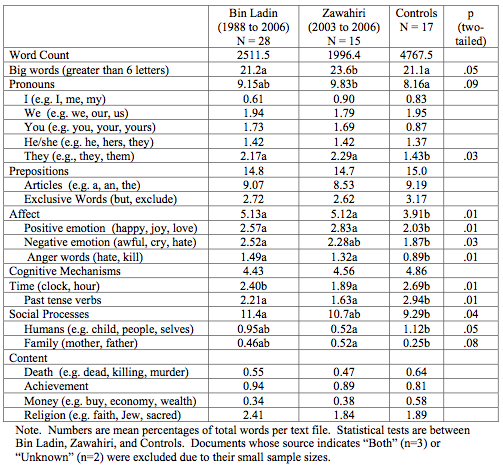

```{r setup, include=FALSE}
knitr::opts_chunk$set(collapse = T, cache=T, fig.align= "center", message = F, warning = F)
```

## Today's outline

- Repetition Quantitative text analysis concepts
- Regular Expressions
- Dictionary Approaches

    + Deriving a dictionary, "Wordscores version 0.1"
    + External dictionaries
    + Application


- Text analysis workflow
- Creating a text corpus
- Preprocessing
- Regular Expressions


## Set up to work along today's slides

**Packages**
```{r}
# if you don't have the package, install it first
# install.package()
library(stringr)
library(dplyr)
```

**Data**
```{r}
gDat <- read.csv("https://raw.githubusercontent.com/plotly/datasets/master/gapminderDataFiveYear.csv")
```

**Fake Data**
```{r create_fake, echo=F, results='hide'}
file.create(c("block0_dplyr-fake.rmd", "block000_dplyr-fake.rmd.txt", "xblock000_dplyr-fake.rmd"))
```

## Regular expressions

Regular Expressions (regex) are a language or syntax to search in texts.
Regex are used by most search engines in one form or another and are part of almost any programming language. It is truly the heart and soul for string operations. In R, many string functions in `base` R as well as in `stringr` package use regular expressions, even Rstudio's search and replace allows regular expression.

You could use regex to e.g.:

- Count the occurence of certain persons/organization etc. in text
- Calculate the sums of fund discussed in legislation
- Chose your texts based on regexes

In textpreparation, regex are used to remove certain unwanted parts of text.

## Regular expression syntax 

Regular expressions typically specify characters to seek out, possibly with information about repeats and location within the string. This is accomplished with the help of metacharacters that have specific meaning: `$ * + . ? [ ] ^ { } | ( ) \`. 


## String functions related to regular expression
Regular expression is a pattern that describes a specific set of strings with a common structure. It is heavily used for string matching / replacing in all programming languages, although specific syntax may differ a bit. It is truly the heart and soul for string operations. In R, many string functions in `base` R as well as in `stringr` package use regular expressions, even Rstudio's search and replace allows regular expression, we will go into more details about these functions later this week:       

  * identify match to a pattern: `grep(..., value = FALSE)`, `grepl()`, `stringr::str_detect()`
  * extract match to a pattern: `grep(..., value = TRUE)`, `stringr::str_extract()`, `stringr::str_extract_all()`     
  * locate pattern within a string, i.e. give the start position of matched patterns. `regexpr()`, `gregexpr()`, `stringr::str_locate()`, `string::str_locate_all()`     
  * replace a pattern: `sub()`, `gsub()`, `stringr::str_replace()`, `stringr::str_replace_all()`     
  * split a string using a pattern: `strsplit()`, `stringr::str_split()`   
  

## Escape sequences

There are some special characters in R that cannot be directly coded in a string. For example, let's say you specify your pattern with single quotes and you want to find countries with the single quote `'`. You would have to "escape" the single quote in the pattern, by preceding it with `\`, so it's clear it is not part of the string-specifying machinery: 

```{r quote_error}
grep('\'', levels(gDat$country), value = TRUE)
```

## Escape sequences (II)

There are other characters in R that require escaping, and this rule applies to all string functions in R, including regular expressions. See [here](https://stat.ethz.ch/R-manual/R-devel/library/base/html/Quotes.html) for a complete list of R esacpe sequences.        

  * `\'`: single quote. You don't need to escape single quote inside a double-quoted string, so we can also use `"'"` in the previous example.        
  * `\"`: double quote. Similarly, double quotes can be used inside a single-quoted string, i.e. `'"'`.          
  * `\n`: newline.   
  * `\r`: carriage return.   
  * `\t`: tab character.   

> Note: `cat()` and `print()` to handle escape sequences differently, if you want to print a string out with these sequences interpreted, use `cat()`.      

```{r cat_print}
print("a\nb")
cat("a\nb")
```

### Quantifiers

Quantifiers specify how many repetitions of the pattern.   

  * `*`: matches at least 0 times.   
  * `+`: matches at least 1 times.     
  * `?`: matches at most 1 times.    
  * `{n}`: matches exactly n times.    
  * `{n,}`: matches at least n times.    
  * `{n,m}`: matches between n and m times.     

```{r quantifiers}
(strings <- c("a", "ab", "acb", "accb", "acccb", "accccb"))
grep("ac*b", strings, value = TRUE)
grep("ac+b", strings, value = TRUE)
grep("ac?b", strings, value = TRUE)
grep("ac{2}b", strings, value = TRUE)
grep("ac{2,}b", strings, value = TRUE)
grep("ac{2,3}b", strings, value = TRUE)
```

## Task 1  
Find all countries with `ee` in the Gapminder dataset using quantifiers.   

## Task 1 solution  
Find all countries with `ee` in the Gapminder dataset using quantifiers.   

```{r ex_quant, echo = FALSE}
grep("e{2}", levels(gDat$country), value = TRUE)
```

### Position of pattern within the string 

  * `^`: matches the start of the string.   
  * `$`: matches the end of the string.   
  * `\b`: matches the empty string at either edge of a _word_. Don't confuse it with `^ $` which marks the edge of a _string_.   
  * `\B`: matches the empty string provided it is not at an edge of a word.    

```{r position}
(strings <- c("abcd", "cdab", "cabd", "c abd"))
grep("ab", strings, value = TRUE)
grep("^ab", strings, value = TRUE)
grep("ab$", strings, value = TRUE)
grep("\\bab", strings, value = TRUE)
```


## Task 2 
Find all `.txt` files in the "Slides/Week9" folder   


## Task 2 solution
Find all `.txt` files in the "Slides/Week9" folder   

```{r ex_pos, echo = FALSE}
files <- list.files("Slides/Week9")
grep("\\.txt$", files, value = TRUE)
```

### Operators

  * `.`: matches any single character, as shown in the first example. 
  * `[...]`: a character list, matches any one of the characters inside the square brackets. We can also use `-` inside the brackets to specify a range of characters.   
  * `[^...]`: an inverted character list, similar to `[...]`, but matches any characters __except__ those inside the square brackets.  
  * `\`: suppress the special meaning of metacharacters in regular expression, i.e. `$ * + . ? [ ] ^ { } | ( ) \`, similar to its usage in escape sequences. Since `\` itself needs to be escaped in R, we need to escape these metacharacters with double backslash like `\\$`.   
  * `|`: an "or" operator, matches patterns on either side of the `|`.  
  * `(...)`: grouping in regular expressions. This allows you to retrieve the bits that matched various parts of your regular expression so you can alter them or use them for building up a new string. Each group can than be refer using `\\N`, with N being the No. of `(...)` used. This is called __backreference__.    

```{r operators}
(strings <- c("^ab", "ab", "abc", "abd", "abe", "ab 12"))
grep("ab.", strings, value = TRUE)
grep("ab[c-e]", strings, value = TRUE)
grep("ab[^c]", strings, value = TRUE)
grep("^ab", strings, value = TRUE)
grep("\\^ab", strings, value = TRUE)
grep("abc|abd", strings, value = TRUE)
gsub("(ab) 12", "\\1 34", strings)
```

## Task 3

Find countries in the Gapminder data with letter `i` or `t`, and ends with `land`, and replace `land` with `LAND` using backreference.  


## Task 3 solution

Find countries in the Gapminder data with letter `i` or `t`, and ends with `land`, and replace `land` with `LAND` using backreference.  

```{r ex_operator, echo = F}
countries <- gsub("(.*[it].*)land$", "\\1LAND", levels(gDat$country), ignore.case = T)
grep("LAND", countries, value = TRUE)
```


## Character classes

Character classes allows to -- surprise! -- specify entire classes of characters, such as numbers, letters, etc. There are two flavors of character classes, one uses `[:` and `:]` around a predefined name inside square brackets and the other uses `\` and a special character. They are sometimes interchangeable.   

  * `[:digit:]` or `\d`: digits, 0 1 2 3 4 5 6 7 8 9, equivalent to `[0-9]`.  
  * `\D`: non-digits, equivalent to `[^0-9]`.  
  * `[:lower:]`: lower-case letters, equivalent to `[a-z]`.  
  * `[:upper:]`: upper-case letters, equivalent to `[A-Z]`.  
  * `[:alpha:]`: alphabetic characters, equivalent to `[[:lower:][:upper:]]` or `[A-z]`.  
  * `[:alnum:]`: alphanumeric characters, equivalent to `[[:alpha:][:digit:]]` or `[A-z0-9]`.   
  * `\w`: word characters, equivalent to `[[:alnum:]_]` or `[A-z0-9_]`.  
  * `\W`: not word, equivalent to `[^A-z0-9_]`.  
  * `[:xdigit:]`: hexadecimal digits (base 16), 0 1 2 3 4 5 6 7 8 9 A B C D E F a b c d e f, equivalent to `[0-9A-Fa-f]`.
  * `[:blank:]`: blank characters, i.e. space and tab.  
  * `[:space:]`: space characters: tab, newline, vertical tab, form feed, carriage return, space.
  * `\s`: space, ` `.  
  * `\S`: not space.  
  * `[:punct:]`: punctuation characters, ! " # $ % & ' ( ) * + , - . / : ; < = > ? @ [ \ ] ^ _ ` { | } ~.
  * `[:graph:]`: graphical (human readable) characters: equivalent to `[[:alnum:][:punct:]]`.
  * `[:print:]`: printable characters, equivalent to `[[:alnum:][:punct:]\\s]`.
  * `[:cntrl:]`: control characters, like `\n` or `\r`, `[\x00-\x1F\x7F]`.  

Note:       

* `[:...:]` has to be used inside square brackets, e.g. `[[:digit:]]`.     
* `\` itself is a special character that needs escape, e.g. `\\d`. Do not confuse these regular expressions with R escape sequences such as `\t`.      

## General modes for patterns

There are different [syntax standards](http://en.wikipedia.org/wiki/Regular_expression#Standards) for regular expressions, and R offers two:

  * POSIX extended regular expressions (default)
  * Perl-like regular expressions.
  
You can easily switch between by specifying `perl = FALSE/TRUE` in `base` R functions, such as `grep()` and `sub()`. For functions in the `stringr` package, wrap the pattern with `perl()`. The syntax between these two standards are a bit different sometimes, see an example [here](http://www.inside-r.org/packages/cran/stringr/docs/perl). If you had previous experience with Python or Java, you are probably more familiar with the Perl-like mode. But for this tutorial, we will only use R's default POSIX standard.  

There's one last type of regular expression -- "fixed", meaning that the pattern should be taken literally. Specify this via `fixed = TRUE` (base R functions) or wrapping with `fixed()` (`stringr` functions). For example, `"A.b"` as a regular expression will match a string with "A" followed by any single character followed by "b", but as a fixed pattern, it will only match a literal "A.b".  

```{r fixed}
(strings <- c("Axbc", "A.bc"))
pattern <- "A.b"
grep(pattern, strings, value = TRUE)
grep(pattern, strings, value = TRUE, fixed = TRUE)
```

By default, pattern matching is case sensitive in R, but you can turn it off with `ignore.case = TRUE` (base R functions) or wrapping with `ignore.case()` (`stringr` functions). Alternatively, you can use `tolower()` and `toupper()` functions to convert everything to lower or upper case. Take the same example above: 

```{r ignore.case}
pattern <- "a.b"
grep(pattern, strings, value = TRUE)
grep(pattern, strings, value = TRUE, ignore.case = TRUE)
```

## Task 4

Find continents in Gapminder with letter `o` in it.  

## Task 4 solution

Find continents in Gapminder with letter `o` in it.  

```{r ex_case, echo=F}
grep("o", levels(gDat$continent), ignore.case = TRUE, value = TRUE)
```

## Examples

As an example, let's try to integrate everything together, and find all course materials on `dplyr` and extract the topics we have covered. These files all follow our naming strategy: `block` followed by 3 digits, then `_`, then topic. As you can see from the [topic index](http://stat545-ubc.github.io/topics.html), we had two blocks on `dplyr`: the [intro](http://stat545-ubc.github.io/block009_dplyr-intro.html), and [verbs for a single dataset](http://stat545-ubc.github.io/block010_dplyr-end-single-table.html). We'll try to extract the `.rmd` filenames for these blocks. To make the task a bit harder, I also put a few fake files inside the repository that don't quite match our naming strategy!    

We know that the filename should have `block` and `dplyr` in it, and is a Rmd file, so what if we just put these three parts together? 

```{r example_1}
pattern <- "block.*dplyr.*rmd"
grep(pattern, files, value = TRUE)
```

Apart from the two files we wanted, we also got three fake ones: `r paste0(list.files(pattern = "fake"), collapse = ", ")`. Looks like our pattern is not stringent enough. The first fake file does not have 3 digits after `block`, second one does not start with `block`, and last one has `.txt` after `rmd`. So let's try to fix that: 

```{r example_2}
pattern <- "^block\\d{3}_.*dplyr.*rmd$"
(dplyr_file <- grep(pattern, files, value = TRUE))
```

Now we have the two file names stored in `dplyr_file`, let's try to extract the topics out. 

One way to do that is to use a substitution function like `sub()`, `gsub()`, or `str_sub()` to replace anything before and after the topic with empty strings: 

```{r example_3}
(dplyr_topic <- gsub("^block\\d{3}_.*dplyr-", "", dplyr_file))
(dplyr_topic <- gsub("\\.rmd", "", dplyr_topic))
```

Alternatively, instead of using `grep()` + `gsub()`, we can use `str_match()`. As mentioned above, this function will give specific matches for patterns enclosed with `()` operator. We just need to reconstruct our regular expression to specify the topic part:    

```{r example_4}
pattern <- "^block\\d{3}_.*dplyr-(.*)\\.rmd$"
(na.omit(str_match(files, pattern)))
```

The second column of the result data frame gives the topic we needed.  

### Some more advanced string functions     

There are some more advanced string functions that are somewhat related to regular expression, like splitting a string, get a subset of a string, pasting strings together etc. These functions are very useful for data cleaning, and we will get into more details about them later this week. Here is a short introduction with above example.   

From above example, we got two topics on `dplyr`: `r cat(dplyr_topic, sep = ",")`. We can use `strsplit()` function to split the second one, `r cat(dplyr_topic[2])`, into words. The second argument `split` is a regular expression used for splitting, and the function will return a list. We can use `unlist()` function to convert the list into a character vector. Or an alternative function `str_split_fixed()` will return a data frame.   

<!-- *JB: what about something based on `strsplit(dplyr_file, "_")`?* -->

```{r strsplit}
(topic_split <- unlist(strsplit(dplyr_topic[2], "-")))
(topic_split <- str_split_fixed(dplyr_topic[2], "-", 3)[1, ])
```

We can also use `paste()` or `paste0()` functions to put them back together. `paste0()` function is equivalent to `paste()` with `sep = ""`. We can use `collapse = "-"` argument to concatenate a character vector into a string:        

```{r paste}
paste(topic_split, collapse = "-")
```

Another useful function is `substr()`. It can be used to extract a part of a string with start and end positions. For example, to extract the first three letters in `dplyr_topic`:     

```{r substr}
substr(dplyr_topic, 1, 3)
```

### Exercise
Get all markdown documents on peer review and extract the specific topics.        

> Hint: file names should start with `peer-review`.   

```{r ex_final, echo = FALSE}
cat(na.omit(str_match(files, "peer-review.*_(.*)\\.md")[, 2]), sep = ",  ")
```

## Regular expression vs shell globbing

The term globbing in shell or Unix-like environment refers to pattern matching based on wildcard characters. A wildcard character can be used to substitute for any other character or characters in a string. Globbing is commonly used for matching file names or paths, and has a much simpler syntax. It is somewhat similar to regular expressions, and that's why people are often confused between them. Here is a list of globbing syntax and their comparisons to regular expression:   

  * `*`: matches any number of unknown characters, same as `.*` in regular expression.  
  * `?`: matches one unknown character, same as `.` in regular expression.  
  * `\`: same as regular expression.  
  * `[...]`: same as regular expression.  
  * `[!...]`: same as `[^...]` in regular expression.   

<!-- *JB: I know that I've been burned by confusing regular expressions and globbing. Can you recall where this can hurt you? I can't right now! But we included this to alert them to something and I wish we could clarify what to watch out for.*  -->

## Resources

  * Regular expression in R [official document](https://stat.ethz.ch/R-manual/R-devel/library/base/html/regex.html).  
  * Perl-like regular expression: regular expression in perl [manual](http://perldoc.perl.org/perlre.html#Regular-Expressions).   
  * [`qdapRegex` package](http://trinkerrstuff.wordpress.com/2014/09/27/canned-regular-expressions-qdapregex-0-1-2-on-cran/): a collection of handy regular expression tools, including handling abbreviations, dates, email addresses, hash tags, phone numbers, times, emoticons, and URL etc.   
  * Recently, there are some attemps to create human readable regular expression packages, [Regularity](https://github.com/andrewberls/regularity) in Ruby is a very successful one. Unfortunately, its implementation in R is still quite beta at this stage, not as friendly as Regularity yet. But keep an eye out, better packages may become available in the near future!    
  * There are some online tools to help learn, build and test regular expressions. On these websites, you can simply paste your test data and write regular expression, and matches will be highlighted.   
  + [regexpal](http://regexpal.com/)    
  + [RegExr](http://www.regexr.com/)   

```{r delete_fake, echo=F, results='hide'}
file.remove(c("block0_dplyr-fake.rmd", "block000_dplyr-fake.rmd.txt", "xblock000_dplyr-fake.rmd"))
```

## Rational for dictionaries

- Rather than count words that occur, pre-define words associated with specific meanings
- Two components:

    + **key** the label for the equivalence class for the concept or canonical term
    + **values** (multiple) terms or patterns that are declared equivalent occurences of the key class

- Frequently involves lemmatization: transformation of all in ected word forms to their "dictionary look-up form" -- more powerful than stemming


## Dictionary approaches

Dictionaries help classifying texts to categories or determine their content of a known concept.

- Which text pertain to which categories?
- Which texts contain how much of a concept?

- Compared to e.g. CMP

    + Dictionaries require knowing the semantic form of the concept
    + i.e. one would need a complete dictionary of left or right statements


## Creating dictionaries

**Creating Dictionaries**

- Scheme of classification
- Documents with known properties or classification

    + Training Set: Used to construct a dictionary
    + Test Set: Used to test dictionary (properties/classification is known)
    + Classification Set: Text to be classified/scaled with the dictionary


## Creating dictionaries (II)

**Sequence of steps**

- Collect the words that discriminate between categories/concepts, i.e. create a dictionary

    + Existing dictionaries
    + Creating a dictionary

- Quantify the occurence of these words in texts
- Validate


## Creating dictionaries (III)

**Methods (though not exhaustive)**

- By hand

    + Based on a Training Set (Laver & Garry)
    + Based on a previously existing list or external Sources (Dodds & Danforth)

- Automatically (Wordscores)

    + Replaces the creation of a dictionary as in Laver and Garry 2000


## Estimating Policy Positions from Political Texts

**Laver & Garry**

- Goal: Generating party positions for British and Irish manifestos

- Coding scheme similar to the CMP's

    + More hierachical, larger number of categories
    + Each category has a pro-, con- and neutral variant

## Estimating Policy Positions from Political Texts (II)

**Training Set** 

- Manifestos of Labour and Cons (UK) in 1992

    + Pool of 'keywords'
    + $N_{L} \geq 2N_{R}=>$ Dictionary element left
    + $N_{R} \geq 2N_{L}=>$ Dictionary element right

- Allocate selected words to the coding scheme's categories

## Estimating Policy Positions from Political Texts (III)
    
- Count the occurence of the elements in the dictionary in manifestos

    + Britain (1992 & 1997)
    + Ireland (1992 & 1997)

- Left-right-scaling: $\frac{R-L}{R+L}$ (see Session 7 and assignment 2)

    + "Updating process"
    + $Econ_{LR}$
    + $Soc_{LR}$


## Estimating Policy Positions from Political Texts (III)


- Test-Set: Crossvalidation

    + Expert Surveys
    + CMP Coding/Revised CMP Coding

```{r, out.width = "250px", echo = F}

```  

## Next Session


- Regular expressions
- Dictionary-based content analysis